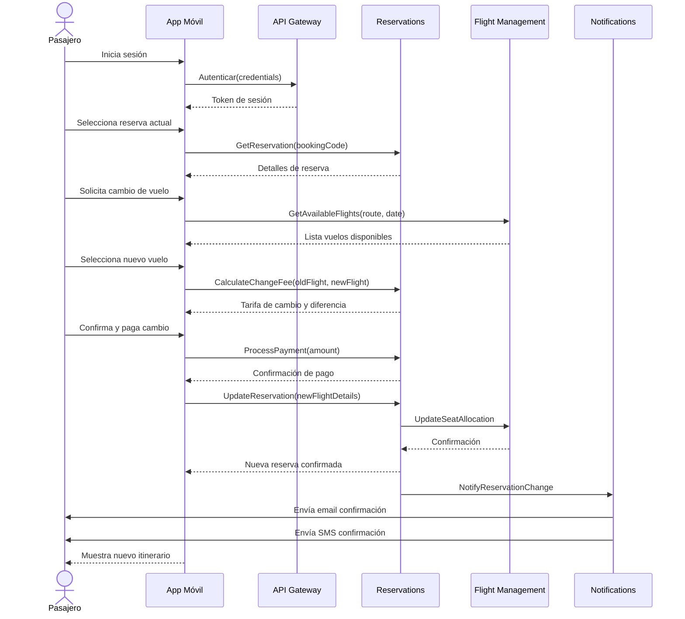
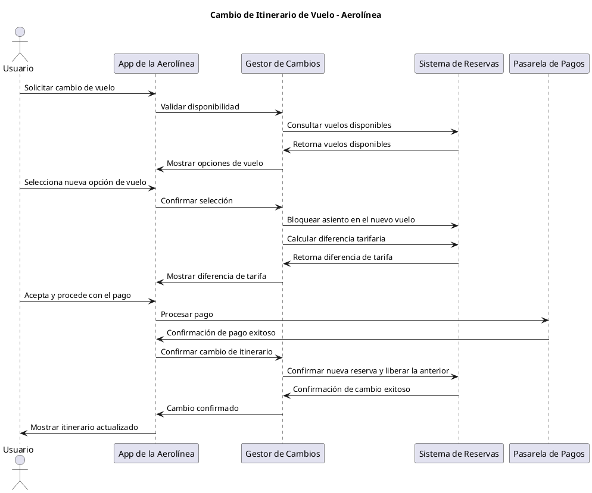
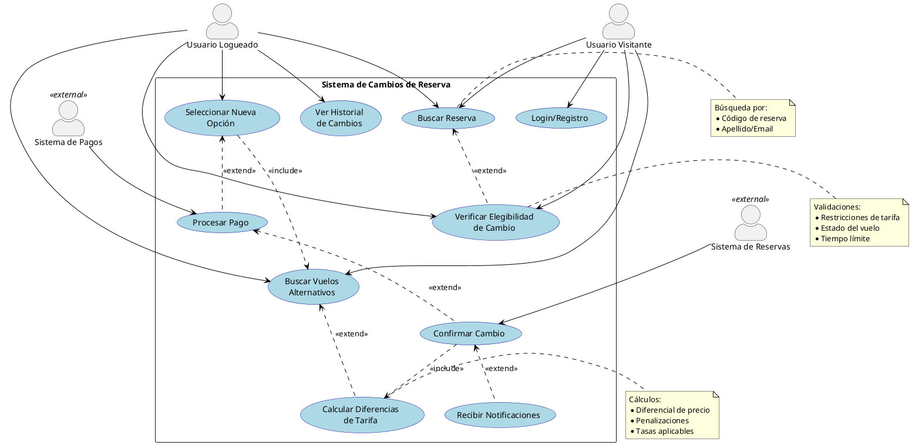
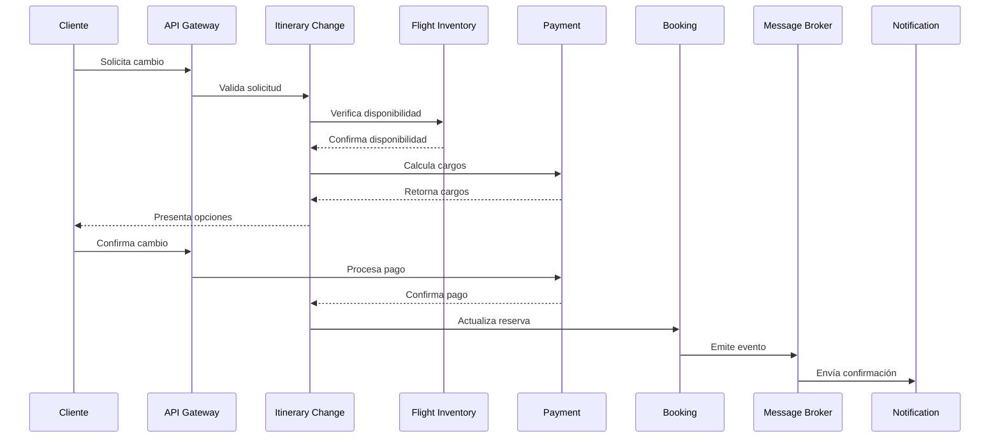
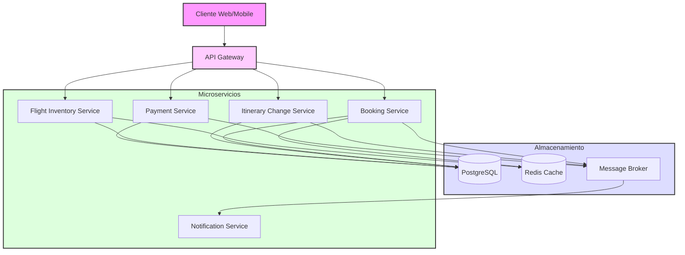
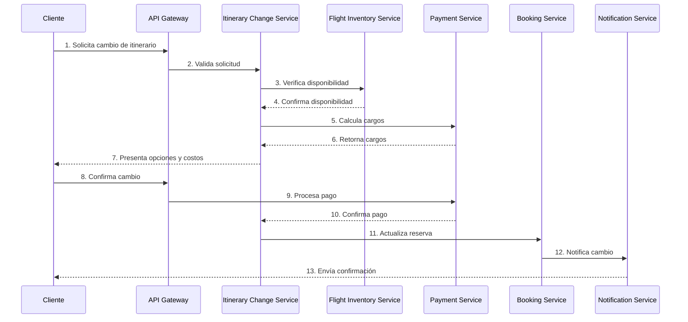
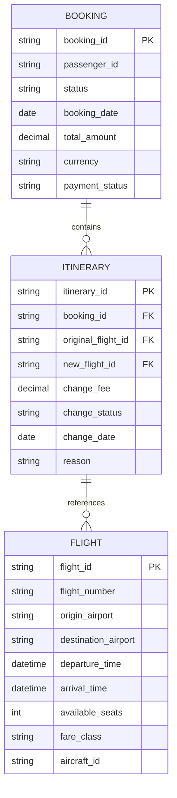
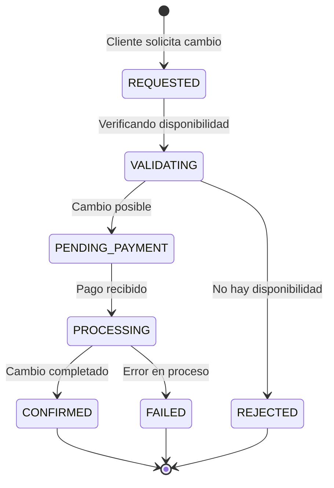
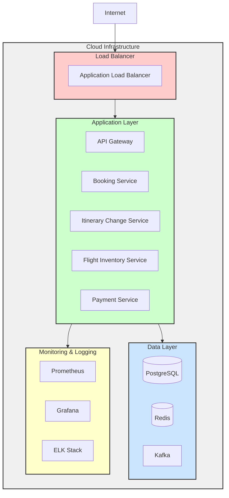

# Prompt 1: Dame un ejemplo de diagrama de secuencia en PlantUML de una app de cambio de itinerarios de vuelo de una aerolinea similar a Copa

## Claude

Crearé un diagrama de secuencia que muestre el proceso de cambio de itinerario de vuelo.



He creado un diagrama de secuencia que muestra el flujo completo de cambio de itinerario. El diagrama incluye:

1. Autenticación inicial del pasajero
2. Consulta de la reserva actual
3. Búsqueda de vuelos alternativos disponibles
4. Cálculo de tarifas de cambio
5. Proceso de pago
6. Actualización de la reserva
7. Notificaciones al pasajero

Los principales actores/sistemas son:

- Pasajero (usuario final)
- App Móvil (interfaz de usuario)
- API Gateway (capa de servicios)
- Sistema de Reservaciones
- Sistema de Gestión de Vuelos
- Sistema de Notificaciones

¿Te gustaría que modifique alguna parte del diagrama o que agregue algún escenario adicional, como por ejemplo el manejo de errores o cancelaciones?

## ChatGPT

Aquí tienes un ejemplo de **diagrama de secuencia en PlantUML** para una **app de cambio de itinerarios de vuelo** de una aerolínea similar a Copa Airlines.

### **Escenario:**

El usuario solicita un cambio de itinerario a través de la app, validando disponibilidad de vuelos y pagando la diferencia si es necesario.

---



---

### **Explicación del flujo:**

1. El usuario solicita un cambio de vuelo desde la app.
2. La app consulta la disponibilidad con el **Gestor de Cambios**, que a su vez consulta con el **Sistema de Reservas**.
3. Se muestra al usuario las opciones disponibles.
4. El usuario selecciona un nuevo vuelo y la app confirma la selección con el **Gestor de Cambios**.
5. El sistema bloquea el nuevo asiento y calcula la diferencia tarifaria.
6. Si hay diferencia de tarifa, el usuario debe realizar el pago a través de la **Pasarela de Pagos**.
7. Tras un pago exitoso, el sistema confirma el cambio y actualiza el itinerario.
8. La app muestra el nuevo itinerario al usuario.

---

Este diagrama cubre la lógica principal para una app de cambio de itinerarios en una aerolínea como Copa Airlines. ¿Necesitas agregar más detalles o particularidades? 🚀

# Prompt 2: Me puedes mostrar la grafica de ese lenguaje?

## Claude

No es necesario, Claude genero el diagrama desde el primer prompt.

## ChatGPT

Aquí tienes el **diagrama de secuencia en PlantUML** generado a partir del código que compartí:

Parece que no tengo la biblioteca necesaria para generar la imagen directamente. Sin embargo, puedes visualizar este diagrama fácilmente usando PlantUML de la siguiente manera:

### **Método 1: Usando un editor online**

1. Copia el código PlantUML que te proporcioné.
2. Ve a [PlantUML Online](https://www.plantuml.com/plantuml/uml/)
3. Pega el código y haz clic en "Submit" para ver el diagrama.

### **Método 2: Usando una extensión en VSCode**

1. Instala la extensión **PlantUML** en VSCode.
2. Crea un archivo con extensión `.puml`.
3. Pega el código en el archivo y usa `Alt + D` para generar la vista previa.

Si quieres que genere la imagen de otra manera, dime y lo intento de otra forma. 🚀

## Análisis de la respuesta

Para la generación de diagramas Claude parece tener un mejor procesamiento de la solicitud. Se genero el codigo desde el primer prompt y adicional nos proporciono un preview.

ChatGPT aun despues del segundo prompt indicandole que nos mostrara el diagrama no fue capaz de hacerlo, sin embargo nos proporciono pasos con herramientas donde podriamos vizualizarlo.

# Prompt 3: Ahora ayudame a crear el diagrama de arquitectura utilizando la libreria Diagrams y Python para pintarla suponiendo que uso AWS.

## Claude

Te ayudaré a crear un diagrama de arquitectura usando la librería Diagrams que muestre la infraestructura AWS para esta aplicación de cambio de itinerarios.

```python
from diagrams import Diagram, Cluster
from diagrams.aws.mobile import APIGateway
from diagrams.aws.compute import Lambda
from diagrams.aws.database import RDS, DynamoDB
from diagrams.aws.security import Cognito
from diagrams.aws.integration import SNS, SQS
from diagrams.aws.network import ELB
from diagrams.aws.storage import S3
from diagrams.aws.compute import ElasticContainerService as ECS
from diagrams.aws.network import CloudFront

with Diagram("Airline Flight Change Architecture", show=False):
    # Cliente y CDN
    cdn = CloudFront("CloudFront CDN")

    # Auth
    with Cluster("Authentication"):
        auth = Cognito("Cognito User Pool")

    # API Gateway y Load Balancer
    api = APIGateway("API Gateway")
    lb = ELB("Load Balancer")

    # Servicios en Contenedores
    with Cluster("Container Services"):
        services = [
            ECS("Reservation Service"),
            ECS("Flight Management"),
            ECS("Payment Service"),
            ECS("Notification Service")
        ]

    # Funciones Lambda
    with Cluster("Serverless Functions"):
        functions = [
            Lambda("Availability Calculator"),
            Lambda("Fee Calculator"),
            Lambda("Booking Updater")
        ]

    # Base de datos
    with Cluster("Databases"):
        reservation_db = RDS("Reservations DB")
        flight_db = RDS("Flights DB")
        cache = DynamoDB("Cache Layer")

    # Colas y Notificaciones
    with Cluster("Message Services"):
        queue = SQS("Processing Queue")
        notification = SNS("Notifications")

    # Storage
    docs = S3("Documents Storage")

    # Conexiones
    cdn >> api
    api >> auth
    api >> lb
    lb >> services
    services[0] >> functions[0]
    services[0] >> functions[1]
    services[0] >> functions[2]

    for service in services:
        service >> reservation_db
        service >> flight_db
        service >> cache

    services[3] >> notification
    services[0] >> queue

    for function in functions:
        function >> reservation_db
        function >> flight_db

    notification >> docs

```

Este código genera un diagrama de arquitectura AWS que incluye:

1. Capa de Frontend/Distribución:

   - CloudFront como CDN

2. Autenticación:

   - Cognito para gestión de usuarios

3. API y Balanceo:

   - API Gateway
   - Elastic Load Balancer

4. Servicios Principales (en ECS):

   - Servicio de Reservaciones
   - Gestión de Vuelos
   - Servicio de Pagos
   - Servicio de Notificaciones

5. Funciones Serverless:

   - Calculador de Disponibilidad
   - Calculador de Tarifas
   - Actualizador de Reservas

6. Bases de Datos:

   - RDS para Reservaciones
   - RDS para Vuelos
   - DynamoDB como capa de caché

7. Mensajería:

   - SQS para procesamiento asíncrono
   - SNS para notificaciones

8. Almacenamiento:
   - S3 para documentos

Para ejecutar este código necesitarás:

1. Tener instalada la librería Diagrams (`pip install diagrams`)
2. Tener Graphviz instalado en tu sistema
3. Guardar el código en un archivo .py y ejecutarlo

¿Te gustaría que modifique algo en la arquitectura o que agregue algún componente adicional?

## ChatGPT

Parece que no tengo la biblioteca **Diagrams** instalada en este entorno, pero puedes generar el diagrama en tu máquina local siguiendo estos pasos:

### **1️⃣ Instalar la librería**

Ejecuta este comando en tu terminal para instalar **Diagrams**:

```bash
pip install diagrams
```

### **2️⃣ Código Python para generar el diagrama**

Guarda este código en un archivo `diagrama.py` y ejecútalo:

```python
from diagrams import Diagram, Cluster
from diagrams.aws.compute import EC2
from diagrams.aws.database import RDS
from diagrams.aws.network import APIGateway
from diagrams.aws.integration import SQS
from diagrams.aws.security import Cognito
from diagrams.aws.storage import S3
from diagrams.aws.analytics import KinesisDataStreams
from diagrams.onprem.client import Users

# Crear el diagrama de arquitectura
with Diagram("Arquitectura de Cambio de Itinerario de Vuelo", show=True, direction="LR"):

    user = Users("Usuario")

    with Cluster("Front-end"):
        mobile_app = S3("App Móvil")
        web_app = S3("Web App")

    with Cluster("Back-end en AWS"):
        api_gateway = APIGateway("API Gateway")
        auth = Cognito("Autenticación")

        with Cluster("Servicios de Aplicación"):
            flight_service = EC2("Gestor de Cambios de Vuelo")
            payment_service = EC2("Servicio de Pagos")

        with Cluster("Colas y Eventos"):
            sqs_queue = SQS("Cola de Mensajes")
            event_stream = KinesisDataStreams("Flujo de Eventos")

        with Cluster("Base de Datos"):
            reservations_db = RDS("Base de Datos de Reservas")

    # Conexiones
    user >> mobile_app
    user >> web_app

    mobile_app >> api_gateway
    web_app >> api_gateway

    api_gateway >> auth
    auth >> api_gateway

    api_gateway >> flight_service
    api_gateway >> payment_service

    flight_service >> sqs_queue
    sqs_queue >> event_stream

    flight_service >> reservations_db
    payment_service >> reservations_db
```

### **3️⃣ Ejecutar el script**

Corre el script con:

```bash
python diagrama.py
```

Esto generará una imagen con la **arquitectura en AWS para la app de cambio de itinerarios de vuelo**.

Déjame saber si necesitas modificaciones o mejoras en la arquitectura. 🚀

Te describo las funcionalidades básicas de un sistema de gestión de reservas de aerolíneas, ordenadas por prioridad:

1. **Gestión de inventario de vuelos**

   - Control de asientos disponibles en tiempo real
   - Gestión de rutas y frecuencias
   - Control de capacidad por clase (económica, business, primera)

2. **Motor de reservas**

   - Búsqueda de vuelos disponibles
   - Proceso de reserva de asientos
   - Cálculo dinámico de tarifas
   - Gestión de conexiones entre vuelos

3. **Gestión de pasajeros**

   - Registro de datos personales
   - Documentación de viaje
   - Historial de reservas
   - Programas de fidelización

4. **Sistema de pagos**

   - Procesamiento de pagos
   - Gestión de reembolsos
   - Múltiples métodos de pago
   - Facturación

5. **Check-in y gestión de embarque**

   - Check-in online y en aeropuerto
   - Asignación de asientos
   - Gestión de equipaje
   - Emisión de tarjetas de embarque

6. **Gestión de cambios y cancelaciones**

   - Modificación de reservas
   - Políticas de cancelación
   - Cálculo de penalizaciones
   - Reubicación en otros vuelos

7. **Reporting y análisis**

   - Ocupación de vuelos
   - Ingresos por ruta
   - Análisis de tendencias
   - Reportes operativos

8. **Integración con otros sistemas**

   - GDS (Global Distribution Systems)
   - Sistemas de control de operaciones
   - APIs para terceros
   - Sistemas de meteorología

9. **Gestión de servicios adicionales**

   - Selección de comidas
   - Servicios especiales
   - Upgrade de clase
   - Venta de servicios auxiliares

10. **Comunicación con pasajeros**
    - Notificaciones de vuelo
    - Alertas de cambios
    - Confirmaciones de reserva
    - Comunicación de incidencias

Te detallo los principales beneficios para el cliente al usar un sistema de gestión de reservas de aerolíneas:

1. **Conveniencia y Accesibilidad**

   - Reservas 24/7 desde cualquier dispositivo
   - Eliminación de necesidad de visitar agencias físicas
   - Acceso inmediato a toda la información de vuelos
   - Gestión autónoma de sus reservas

2. **Ahorro de Tiempo**

   - Proceso de reserva rápido y simplificado
   - Check-in online anticipado
   - Comparación instantánea de opciones de vuelo
   - Actualización automática de información

3. **Ahorro de Dinero**

   - Acceso a ofertas y promociones especiales
   - Comparación fácil de tarifas
   - Visibilidad de fechas con mejores precios
   - Acumulación de puntos/millas de fidelización

4. **Mayor Control y Flexibilidad**

   - Selección de asientos en tiempo real
   - Modificación de reservas online
   - Gestión de preferencias personales
   - Cancelaciones autoservicio

5. **Mejor Experiencia de Viaje**

   - Notificaciones proactivas sobre el vuelo
   - Información actualizada sobre cambios
   - Gestión digital de documentos de viaje
   - Personalización de servicios adicionales

6. **Transparencia**

   - Información clara sobre precios y condiciones
   - Desglose detallado de costos
   - Visibilidad del estado de la reserva
   - Políticas de cambio y cancelación claras

7. **Seguridad y Confianza**

   - Confirmación inmediata de reservas
   - Almacenamiento seguro de datos personales
   - Historial de transacciones accesible
   - Pagos seguros online

8. **Servicios Personalizados**

   - Recomendaciones basadas en preferencias
   - Ofertas personalizadas
   - Recordatorios automáticos
   - Atención a necesidades especiales

9. **Integración con Otros Servicios**

   - Reserva de servicios adicionales (hotel, coche)
   - Conexión con programas de fidelización
   - Integración con calendarios personales
   - Compartir itinerarios fácilmente

10. **Soporte Post-Venta**
    - Acceso a atención al cliente 24/7
    - Gestión de reclamaciones online
    - Seguimiento de equipaje
    - Feedback y valoraciones

Estos beneficios contribuyen a:

- Mejorar la satisfacción del cliente
- Aumentar la lealtad a la aerolínea
- Reducir la fricción en el proceso de compra
- Proporcionar una experiencia de viaje más fluida y agradable

Te describo el customer journey típico de un cliente que utiliza un sistema de gestión de reservas de aerolíneas, desde la planificación hasta el post-viaje:

### 1. Fase de Planificación

- **Búsqueda inicial**

  - Ingreso al sitio web/app de la aerolínea
  - Introducción de criterios de búsqueda (origen, destino, fechas, pasajeros)
  - Exploración de diferentes opciones de vuelos
  - Comparación de precios y horarios

- **Selección de vuelo**
  - Revisión de detalles del vuelo (duración, escalas, tipo de avión)
  - Verificación de tarifas y condiciones
  - Selección de clase de viaje
  - Revisión de servicios incluidos

### 2. Fase de Reserva

- **Proceso de reserva**

  - Selección de asientos
  - Ingreso de datos de pasajeros
  - Añadir servicios adicionales (equipaje extra, comidas especiales)
  - Selección de método de pago

- **Confirmación**
  - Revisión final de la reserva
  - Proceso de pago
  - Recepción de confirmación por email
  - Almacenamiento de reserva en cuenta personal

### 3. Pre-vuelo

- **Preparación**

  - Recepción de recordatorios del vuelo
  - Check-in online (24-48h antes)
  - Selección/confirmación de asiento
  - Descarga de tarjeta de embarque

- **Gestión de cambios (si necesario)**
  - Modificación de horarios/fechas
  - Actualización de servicios especiales
  - Gestión de cancelaciones
  - Solicitud de reembolsos

### 4. Día del Vuelo

- **En el aeropuerto**

  - Check-in en mostrador (si no se hizo online)
  - Facturación de equipaje
  - Paso por seguridad usando boarding pass
  - Monitoreo de estado del vuelo

- **Pre-embarque**
  - Localización de puerta de embarque
  - Recepción de actualizaciones de vuelo
  - Gestión de cambios de última hora
  - Embarque según grupo asignado

### 5. Durante el Vuelo

- **Servicios a bordo**
  - Acceso a servicios reservados
  - Compras a bordo
  - Uso de entretenimiento
  - Registro de incidencias

### 6. Post-Vuelo

- **Llegada**

  - Recogida de equipaje
  - Notificación de llegada de equipaje
  - Reporte de incidencias (si las hay)

- **Seguimiento**
  - Acumulación de puntos/millas
  - Encuesta de satisfacción
  - Actualización del historial de viajes
  - Recepción de ofertas personalizadas

### Puntos de Contacto Digital

Durante todo el journey, el cliente interactúa con:

- Sitio web de la aerolínea
- Aplicación móvil
- Emails automatizados
- SMS/Notificaciones push
- Quioscos de autoservicio
- Pantallas de información
- Chatbots/Asistentes virtuales

### Momentos Críticos

Los momentos más importantes donde el sistema debe ser especialmente eficiente:

1. Búsqueda y reserva inicial
2. Proceso de pago
3. Check-in online
4. Notificaciones de cambios
5. Gestión de incidencias

Este journey puede variar según:

- Tipo de viaje (doméstico/internacional)
- Política de la aerolínea
- Nivel de digitalización
- Servicios contratados
- Programa de fidelización del cliente

Te detallo los casos de uso más importantes para un MVP de gestión de cambios de itinerario, ordenados por prioridad y agrupados por funcionalidad:

### 1. Consulta de Reserva

1. **Buscar Reserva**

   - Input: Código de reserva + Apellido/Email
   - Output: Detalles de la reserva actual
   - Validación de que la reserva existe y está activa

2. **Verificar Elegibilidad de Cambio**
   - Validar si la reserva permite cambios
   - Verificar estado del vuelo (no iniciado/completado)
   - Comprobar restricciones de la tarifa

### 2. Búsqueda de Alternativas

3. **Buscar Vuelos Alternativos**

   - Por cambio de fecha (mismo origen-destino)
   - Por cambio de ruta (nuevo destino)
   - Mostrar disponibilidad y tarifas

4. **Calcular Diferencias de Tarifa**
   - Cálculo de diferencial de precio
   - Cálculo de penalizaciones aplicables
   - Mostrar costo total del cambio

### 3. Proceso de Cambio

5. **Seleccionar Nueva Opción**

   - Selección del nuevo vuelo
   - Confirmación de nuevos horarios
   - Vista previa del cambio

6. **Procesar Pago de Diferencias**

   - Gestión del pago adicional (si aplica)
   - Proceso de reembolso (si aplica)
   - Confirmación de transacción

7. **Confirmar Cambio**
   - Actualización de la reserva
   - Generación de nuevo itinerario
   - Cancelación del vuelo anterior

### 4. Notificaciones

8. **Enviar Confirmaciones**
   - Email de confirmación del cambio
   - Nuevo itinerario en PDF
   - Comprobante de cargo/reembolso

### 5. Gestión de Errores

9. **Manejar Fallos**
   - Reversión de cambios fallidos
   - Notificación de errores
   - Log de intentos fallidos

### Consideraciones Técnicas Importantes:

- Manejo de concurrencia en reservas
- Consistencia en el inventario de asientos
- Registro de auditoría de cambios
- Timeout en sesiones de cambio
- Validación de reglas de negocio
- Integración con sistema de pagos
- Gestión de estados de la transacción

### Datos Mínimos Necesarios:

1. **Reserva**

   - Código de reserva
   - Estado
   - Pasajeros
   - Vuelos actuales
   - Tarifa aplicada

2. **Vuelo**

   - Número de vuelo
   - Origen/Destino
   - Fecha/Hora
   - Disponibilidad
   - Precios

3. **Cambio**
   - ID de transacción
   - Tipo de cambio
   - Diferencial de precio
   - Estado del cambio
   - Timestamp

Este MVP proporcionaría la funcionalidad básica necesaria para gestionar cambios de itinerario, manteniendo la integridad de las reservas y asegurando una experiencia de usuario aceptable.

Te propongo un diagrama de casos de uso en PlantUML que representa la funcionalidad del MVP, diferenciando entre usuarios visitantes y logueados:



Este diagrama muestra:

1. **Actores**:

   - Usuario Visitante: Puede realizar operaciones básicas sin autenticación
   - Usuario Logueado: Tiene acceso a todas las funcionalidades
   - Sistema de Pagos: Sistema externo para procesar pagos
   - Sistema de Reservas: Sistema externo para gestionar reservas

2. **Casos de Uso**:

   - Organizados en secuencia lógica de operación
   - Con relaciones de extensión (<<extend>>) para funcionalidades opcionales
   - Con relaciones de inclusión (<<include>>) para funcionalidades requeridas

3. **Notas**:

   - Detalles importantes sobre casos de uso clave
   - Validaciones y cálculos relevantes

4. **Relaciones**:

   - Muestra claramente qué puede hacer cada tipo de usuario
   - Indica la interacción con sistemas externos
   - Establece el flujo lógico de operaciones

5. **Agrupación**:
   - Todo contenido en un sistema rectangular que representa el alcance del MVP
   - Clara separación de responsabilidades

El diagrama sigue las buenas prácticas de UML:

- Nombres descriptivos y concisos
- Relaciones claramente definidas
- Uso apropiado de estereotipos
- Agrupación lógica de funcionalidades
- Inclusión de sistemas externos relevantes
- Notas explicativas en casos clave

Te ayudo con un modelo básico para un sistema de cambio de itinerarios aéreos. Aquí están las 3 entidades fundamentales:

1. **Reserva (Booking)**

   - ID_Reserva (PK)
   - ID_Cliente (FK)
   - Estado (confirmada, pendiente, cancelada)
   - Fecha_Creación
   - Precio_Total
   - Número_Pasajeros
   - Código_Reserva (alfanumérico para el cliente)

2. **Vuelo (Flight)**

   - ID_Vuelo (PK)
   - Número_Vuelo
   - ID_Aerolínea
   - Origen
   - Destino
   - Fecha_Salida
   - Hora_Salida
   - Fecha_Llegada
   - Hora_Llegada
   - Capacidad_Total
   - Asientos_Disponibles
   - Estado (programado, retrasado, cancelado)

3. **Segmento_Reserva (BookingSegment)**
   - ID_Segmento (PK)
   - ID_Reserva (FK)
   - ID_Vuelo (FK)
   - Estado_Segmento
   - Número_Asiento
   - Clase_Servicio (económica, business, primera)
   - Precio_Segmento

**Relaciones:**

- Una **Reserva** puede tener múltiples **Segmentos_Reserva** (relación 1:N) para manejar vuelos con escalas
- Cada **Segmento_Reserva** está asociado a un único **Vuelo** (relación N:1)
- La entidad **Segmento_Reserva** actúa como una tabla de unión que permite rastrear qué vuelos específicos forman parte de una reserva

Esta estructura permite:

- Gestionar cambios de itinerario modificando los segmentos
- Mantener un historial de cambios
- Manejar reservas con múltiples vuelos
- Controlar la disponibilidad de asientos
- Calcular diferencias de precio en cambios de itinerario

Como arquitecto de software, te ayudaré a identificar las 3 entidades fundamentales para un sistema de cambio de itinerarios en reservas aerolíneas, sus campos esenciales y sus relaciones:

1. **Reserva (Booking)**

   - `booking_id` (Identificador único)
   - `passenger_id` (Relación con el pasajero)
   - `booking_status` (Confirmada, Pendiente, Cancelada)
   - `booking_date` (Fecha de la reserva)
   - `total_amount` (Monto total)
   - `currency` (Moneda)
   - `payment_status` (Estado del pago)

2. **Itinerario (Itinerary)**

   - `itinerary_id` (Identificador único)
   - `booking_id` (Relación con la reserva)
   - `original_flight_id` (Vuelo original)
   - `new_flight_id` (Vuelo nuevo en caso de cambio)
   - `change_fee` (Cargo por cambio)
   - `change_status` (Pendiente, Aprobado, Rechazado)
   - `change_date` (Fecha del cambio)
   - `reason` (Motivo del cambio)

3. **Vuelo (Flight)**
   - `flight_id` (Identificador único)
   - `flight_number` (Número de vuelo)
   - `origin_airport` (Aeropuerto de salida)
   - `destination_airport` (Aeropuerto de llegada)
   - `departure_datetime` (Fecha y hora de salida)
   - `arrival_datetime` (Fecha y hora de llegada)
   - `available_seats` (Asientos disponibles)
   - `fare_class` (Clase de tarifa)
   - `aircraft_id` (Identificador de la aeronave)

**Relaciones entre las entidades:**

1. **Reserva - Itinerario (1:N)**

   - Una reserva puede tener múltiples itinerarios (en caso de vuelos con escalas o cambios históricos)
   - Cada itinerario pertenece a una única reserva

2. **Itinerario - Vuelo (N:2)**

   - Cada itinerario está relacionado con hasta dos vuelos:
     - El vuelo original
     - El vuelo nuevo (en caso de cambio)
   - Un vuelo puede estar asociado a múltiples itinerarios

3. **Reserva - Vuelo (M:N)**
   - Una reserva puede incluir múltiples vuelos
   - Un vuelo puede estar asociado a múltiples reservas

**Consideraciones adicionales:**

- Es importante mantener un historial de cambios en los itinerarios para auditoría
- Se deben considerar las políticas de cambio y tarifas asociadas
- El sistema debe manejar la disponibilidad de asientos en tiempo real
- Se debe considerar la gestión de listas de espera para vuelos llenos
- Es crucial mantener la integridad referencial entre las entidades

Este modelo de datos proporciona la base necesaria para gestionar de manera eficiente los cambios de itinerario, manteniendo la trazabilidad y permitiendo una gestión efectiva de las modificaciones en las reservas.

Entiendo que ya tienes definido el modelo de datos base y ahora necesitas una visión más completa de la arquitectura del sistema. Te ayudaré a diseñar una arquitectura robusta para el sistema de cambio de itinerarios.

**1. Arquitectura General (Patrón de Microservicios)**

Propongo los siguientes servicios principales:

1. **Booking Service (Servicio de Reservas)**

   - Gestión del ciclo de vida de las reservas
   - Validación de disponibilidad
   - Cálculo de tarifas y cargos
   - API endpoints:
     - `POST /bookings` (crear reserva)
     - `GET /bookings/{id}` (consultar reserva)
     - `PUT /bookings/{id}/status` (actualizar estado)

2. **Itinerary Change Service (Servicio de Cambios)**

   - Gestión de solicitudes de cambio
   - Validación de reglas de negocio para cambios
   - Cálculo de diferencias tarifarias
   - API endpoints:
     - `POST /changes/request` (solicitar cambio)
     - `GET /changes/{id}` (consultar estado del cambio)
     - `PUT /changes/{id}/confirm` (confirmar cambio)

3. **Flight Inventory Service (Servicio de Inventario)**

   - Gestión de disponibilidad de vuelos
   - Control de asientos
   - Bloqueo temporal de inventario
   - API endpoints:
     - `GET /flights/availability`
     - `POST /flights/hold`
     - `PUT /flights/release`

4. **Payment Service (Servicio de Pagos)**
   - Procesamiento de pagos
   - Reembolsos
   - Cargos por cambio
   - API endpoints:
     - `POST /payments`
     - `POST /refunds`
     - `GET /payments/{id}`

**2. Componentes de Infraestructura**

- **API Gateway**

  - Enrutamiento
  - Rate limiting
  - Autenticación/Autorización
  - Logging

- **Message Broker (Kafka/RabbitMQ)**

  - Comunicación asíncrona entre servicios
  - Eventos de cambio de estado
  - Notificaciones

- **Cache Distribuida (Redis)**

  - Caché de disponibilidad
  - Bloqueos temporales
  - Sesiones de usuario

- **Base de Datos**
  - PostgreSQL para datos transaccionales
  - MongoDB para logs y auditoría

**3. Flujo de Cambio de Itinerario**



**4. Consideraciones de Diseño**

1. **Resiliencia**

   - Circuit breakers
   - Retry policies
   - Fallbacks
   - Timeouts configurables

2. **Escalabilidad**

   - Servicios stateless
   - Caché distribuida
   - Sharding de bases de datos
   - Auto-scaling

3. **Consistencia**

   - Saga pattern para transacciones distribuidas
   - Compensating transactions
   - Event sourcing

4. **Monitoreo**
   - Distributed tracing
   - Métricas de negocio
   - Health checks
   - Logs centralizados

**5. Aspectos de Seguridad**

- JWT para autenticación
- HTTPS/TLS para todas las comunicaciones
- Encriptación de datos sensibles
- Rate limiting por API key
- Auditoría de cambios

**6. Consideraciones de Implementación**

1. **Tecnologías Sugeridas**

   - Backend: Spring Boot/Node.js
   - Base de Datos: PostgreSQL
   - Cache: Redis
   - Message Broker: Kafka
   - API Gateway: Kong/Netflix Zuul

2. **Prácticas DevOps**
   - CI/CD pipelines
   - Infrastructure as Code
   - Containerization (Docker)
   - Orchestration (Kubernetes)

¿Te gustaría que profundicemos en algún aspecto específico de la arquitectura? Podemos explorar en detalle:

- Patrones de diseño específicos
- Flujos de datos
- Estrategias de caché
- Manejo de errores
- Estrategias de deployment
- Cualquier otro aspecto que consideres relevante

Te generaré varios diagramas Mermaid que representan diferentes vistas de la arquitectura del sistema.

**1. Diagrama de Componentes y Servicios**



**2. Diagrama de Flujo de Cambio de Itinerario**



**3. Diagrama de Modelo de Datos**



**4. Diagrama de Estados de Cambio de Itinerario**



**5. Diagrama de Despliegue**



Estos diagramas proporcionan diferentes vistas de la arquitectura:

1. El diagrama de componentes muestra la estructura general del sistema
2. El diagrama de secuencia ilustra el flujo de un cambio de itinerario
3. El diagrama ERD muestra las relaciones entre las entidades principales
4. El diagrama de estados muestra el ciclo de vida de un cambio de itinerario
5. El diagrama de despliegue muestra la infraestructura cloud

¿Te gustaría que profundicemos en algún aspecto específico de estos diagramas o que generemos alguna vista adicional del sistema?


### Realización de la primera historia de usuario

US-01: Consulta de Reserva Actual 
Descripción 

Como pasajero 

Quiero ingresar mi código de reserva y apellido 

Para poder consultar los detalles de mi reserva actual 

Contexto del Negocio 

Es el punto de entrada principal para cualquier gestión de cambios de itinerario 
La validación correcta protege la privacidad de los datos del pasajero 
Debe funcionar tanto para usuarios registrados como no registrados 
Precondiciones 

La reserva debe existir en el sistema 
La reserva no debe estar cancelada o expirada 
El sistema de reservas debe estar operativo 
La conexión con el sistema central de reservas debe estar activa 
Datos de Entrada 

Código de reserva (6 caracteres alfanuméricos) 
Apellido del pasajero principal 
Email (opcional, para envío de información) 
Flujo Principal 

El pasajero accede a la pantalla de consulta de reserva 
Ingresa el código de reserva 
Ingresa su apellido 
El sistema valida los datos ingresados 
El sistema muestra los detalles de la reserva 
Datos a Mostrar 

Información del vuelo: 
Número de vuelo 
Origen y destino 
Fecha y hora de salida/llegada 
Terminal y puerta (si están disponibles) 
Información de la reserva: 
Estado actual 
Clase de servicio 
Restricciones de la tarifa 
Número de pasajeros 
Servicios adicionales contratados 
Información de contacto registrada 
Reglas de Negocio 

El código de reserva debe tener exactamente 6 caracteres 
El apellido debe coincidir exactamente con el registrado 
Mostrar error si la combinación no es válida 
Bloquear acceso después de 3 intentos fallidos 
La sesión expira después de 15 minutos de inactividad 
Flujos Alternativos 

Reserva no encontrada: 
Mostrar mensaje de error claro 
Sugerir verificar los datos 
Ofrecer contacto con servicio al cliente 
Sistema no disponible: 
Mostrar mensaje de error amigable 
Sugerir intentar más tarde 
Proporcionar número de contacto alternativo 
Criterios de Aceptación 

Validación de Datos: 
Validar formato del código de reserva 
Validar que el apellido solo contenga caracteres permitidos 
Mostrar mensajes de error específicos para cada validación 
Seguridad: 
Implementar protección contra ataques de fuerza bruta 
Registrar todos los intentos de acceso 
Encriptar datos sensibles en tránsito 
Rendimiento: 
Tiempo de respuesta < 2 segundos 
Soportar 1000 consultas simultáneas 
Disponibilidad 99.9% 
Interfaz: 
Diseño responsive 
Accesible en dispositivos móviles 
Cumplir con estándares de UX de la aerolínea 
Mockups/Enlaces 

Link al diseño en Figma: [pendiente] 
Link a la documentación API: [pendiente] 
Dependencias Técnicas 

Integración con sistema central de reservas 
Servicio de autenticación 
Sistema de logging y monitoreo 
API de notificaciones para errores críticos 
Consideraciones de Testing 

Pruebas unitarias para validaciones 
Pruebas de integración con sistema de reservas 
Pruebas de carga para concurrencia 
Pruebas de seguridad 
Pruebas de usabilidad 
Métricas de Éxito 

Tasa de éxito en consultas > 98% 
Tiempo promedio de consulta < 2 segundos 
Tasa de errores < 1% 
Satisfacción del usuario > 4.5/5 
Notas Adicionales 

Considerar futura integración con sistemas de login social 
Preparar para soporte multiidioma 
Planear capacidad de búsqueda por email en futuras versiones 

### Tickets de Jira
Crea la primera historia de este sistema:

Backend: Implementación de API para Consulta de Reservas 
ID del Ticket: BK-001 

Título del Ticket: Implementar API para consultar detalles de una reserva 

Descripción: Se debe desarrollar un endpoint en el backend que permita consultar la información de una reserva mediante el código de reserva y apellido o correo electrónico. La API deberá validar la existencia de la reserva y devolver los datos correspondientes. 

Criterios de Aceptación: 

El endpoint debe aceptar código de reserva y apellido/email como parámetros. 
Si la reserva existe, debe devolver un JSON con los detalles de la reserva. 
Si la reserva no existe, debe devolver un mensaje de error adecuado. 
El endpoint debe responder en menos de 3 segundos. 
La API debe estar protegida con autenticación y HTTPS. 
Prioridad: Alta 

Estimación de esfuerzo: 8 horas 

Tareas Técnicas: 

Crear el endpoint GET /reservas/{codigoReserva} en el servicio de reservas. 
Implementar lógica de búsqueda en la base de datos. 
Validar existencia de la reserva y su estado. 
Aplicar formato de respuesta JSON. 
Manejar errores y mensajes adecuados. 
Implementar logs para trazabilidad. 
Notas: La API debe integrarse con el servicio de autenticación para verificar permisos de acceso. 

Backend: Seguridad y Validaciones 
ID del Ticket: BK-002 

Título del Ticket: Implementar validaciones y seguridad en la API de consulta de reserva 

Descripción: Se deben agregar validaciones de entrada, autenticación y protección contra ataques como inyección SQL y fuerza bruta. 

Criterios de Aceptación: 

Los parámetros de entrada deben ser validados antes de la consulta en la base de datos. 
Implementación de autenticación con JWT o API Key. 
Prevención contra ataques de fuerza bruta (rate limiting). 
Manejo de errores con códigos HTTP adecuados. 
Prioridad: Alta 

Estimación de esfuerzo: 5 horas 

Tareas Técnicas: 

Validar código de reserva y apellido/email con expresiones regulares. 
Implementar middleware de autenticación con JWT/API Key. 
Configurar rate limiting con un máximo de intentos por minuto. 
Configurar logs de intentos fallidos para auditoría. 
Notas: Esta tarea debe completarse antes de exponer la API en producción. 

 

Base de Datos: Optimización de Consulta de Reserva 
ID del Ticket: DB-001 

Título del Ticket: Optimizar consulta de reservas en la base de datos 

Descripción: Se debe optimizar la consulta a la base de datos para garantizar un tiempo de respuesta menor a 3 segundos. 

Criterios de Aceptación: 

La consulta debe realizarse en menos de 3 segundos en condiciones normales. 
Se deben agregar índices en los campos clave (código de reserva, apellido/email). 
La consulta debe devolver solo los datos necesarios para la visualización. 
Prioridad: Media 

Estimación de esfuerzo: 4 horas 

Tareas Técnicas: 

Agregar índices en la base de datos en las columnas codigo_reserva y email_pasajero. 
Optimizar la consulta eliminando columnas innecesarias. 
Implementar caché en Redis para consultas repetidas. 
Notas: Se recomienda revisar métricas de rendimiento tras la implementación. 

 

Frontend: Diseño e Implementación del Formulario de Consulta 
 

ID del Ticket: FE-001 

Título del Ticket: Crear formulario de consulta de reserva en frontend 

Descripción: Se debe desarrollar un formulario en la web donde el usuario pueda ingresar su código de reserva y apellido/email para consultar los detalles de su reserva. 

Criterios de Aceptación: 

El formulario debe permitir ingresar código de reserva y apellido/email. 
Debe haber validación en el frontend antes de enviar la solicitud. 
Debe mostrar un mensaje de error si la reserva no existe. 
El resultado debe mostrarse de manera clara y legible. 
Prioridad: Alta 

Estimación de esfuerzo: 6 horas 

Tareas Técnicas: 

Diseñar el formulario con React/Vue/Angular. 
Implementar validaciones en tiempo real. 
Conectar el formulario con la API de consulta de reservas. 
Manejar errores y mostrar mensajes adecuados. 
Notas: Debe ser responsive y accesible en dispositivos móviles. 

 

Frontend: Mostrar Detalles de la Reserva 
ID del Ticket: FE-002 

Título del Ticket: Implementar visualización de detalles de la reserva 

Descripción: Una vez consultada la reserva, se debe mostrar la información de manera estructurada y legible. 

Criterios de Aceptación: 

Se deben mostrar los datos principales de la reserva (número de vuelo, fechas, estado, servicios contratados). 
La interfaz debe ser responsive. 
Debe haber una opción para regresar a la pantalla de búsqueda. 
Si hay un error, debe mostrarse un mensaje claro. 
Prioridad: Media 

Estimación de esfuerzo: 4 horas 

Tareas Técnicas: 

Diseñar la interfaz para mostrar los detalles de la reserva. 
Implementar formato de visualización atractivo y claro. 
Agregar botón de regreso a la pantalla de consulta. 
Notas: Se recomienda seguir los lineamientos de UI/UX del proyecto. 

 

Pruebas: Testing de la Funcionalidad Completa 
ID del Ticket: QA-001 

Título del Ticket: Realizar pruebas de consulta de reserva en backend y frontend 

Descripción: Se deben realizar pruebas unitarias y de integración para validar que la consulta de reserva funciona correctamente. 

Criterios de Aceptación: 

Todas las pruebas unitarias deben pasar con éxito. 
Se deben cubrir casos de éxito y error en la consulta de reserva. 
Se debe probar el rendimiento de la API. 
Prioridad: Alta 

Estimación de esfuerzo: 5 horas 

Tareas Técnicas: 

Escribir pruebas unitarias para la API de consulta de reserva. 
Escribir pruebas de integración entre frontend y backend. 
Realizar pruebas de carga en la API. 
Notas: Se recomienda automatizar las pruebas en CI/CD. 

Resumen de Esfuerzo Total 

Backend (API + Seguridad): 13 horas 
Base de Datos: 4 horas 
Frontend (UI + Conexión con API): 10 horas 
Pruebas: 5 horas 
Total estimado: 32 horas (~4 días de trabajo para un equipo de 2-3 personas). 

### Resultado

Vamos a agregar internacionalización (i18n) y estados de carga (loading states) a nuestra aplicación.

Primero, instalemos las dependencias necesarias:

```diff:frontend/package.json
  "dependencies": {
    "@emotion/react": "^11.10.6",
    "@emotion/styled": "^11.10.6",
    "@mui/icons-material": "^5.11.14",
    "@mui/material": "^5.11.14",
    "axios": "^1.3.4",
    "date-fns": "^2.29.3",
    "formik": "^2.2.9",
+   "i18next": "^22.4.13",
+   "i18next-browser-languagedetector": "^7.0.1",
+   "react-i18next": "^12.2.0",
    "react": "^18.2.0",
    "react-dom": "^18.2.0",
    "react-scripts": "5.0.1",
    "react-transition-group": "^4.4.5",
    "yup": "^1.0.2"
  }
```

Creemos los archivos de internacionalización:

```javascript:frontend/src/i18n/index.js
import i18n from 'i18next';
import { initReactI18next } from 'react-i18next';
import LanguageDetector from 'i18next-browser-languagedetector';
import es from './locales/es.json';
import en from './locales/en.json';

i18n
  .use(LanguageDetector)
  .use(initReactI18next)
  .init({
    resources: {
      es: {
        translation: es
      },
      en: {
        translation: en
      }
    },
    fallbackLng: 'es',
    interpolation: {
      escapeValue: false
    }
  });

export default i18n;
```

```json:frontend/src/i18n/locales/es.json
{
  "search": {
    "title": "Consulta tu Reserva",
    "reservationCode": "Código de Reserva",
    "lastName": "Apellido",
    "email": "Email",
    "searchButton": "Buscar Reserva",
    "validation": {
      "requiredCode": "El código de reserva es requerido",
      "minCode": "El código debe tener al menos {{min}} caracteres",
      "maxCode": "El código no debe exceder {{max}} caracteres",
      "requiredField": "Debe proporcionar apellido o email",
      "invalidEmail": "Email inválido"
    }
  },
  "details": {
    "title": "Detalles de la Reserva",
    "reservationCode": "Código de Reserva",
    "flightNumber": "Número de Vuelo",
    "departureDate": "Fecha de Salida",
    "returnDate": "Fecha de Retorno",
    "services": "Servicios Contratados",
    "backButton": "Volver a la Búsqueda",
    "status": {
      "CONFIRMED": "Confirmada",
      "CANCELLED": "Cancelada",
      "PENDING": "Pendiente"
    }
  },
  "errors": {
    "notFound": "Reserva no encontrada",
    "default": "Error al buscar la reserva",
    "network": "Error de conexión. Por favor, verifica tu conexión a internet"
  }
}
```

```json:frontend/src/i18n/locales/en.json
{
  "search": {
    "title": "Check your Reservation",
    "reservationCode": "Reservation Code",
    "lastName": "Last Name",
    "email": "Email",
    "searchButton": "Search Reservation",
    "validation": {
      "requiredCode": "Reservation code is required",
      "minCode": "Code must be at least {{min}} characters",
      "maxCode": "Code must not exceed {{max}} characters",
      "requiredField": "You must provide last name or email",
      "invalidEmail": "Invalid email"
    }
  },
  "details": {
    "title": "Reservation Details",
    "reservationCode": "Reservation Code",
    "flightNumber": "Flight Number",
    "departureDate": "Departure Date",
    "returnDate": "Return Date",
    "services": "Contracted Services",
    "backButton": "Back to Search",
    "status": {
      "CONFIRMED": "Confirmed",
      "CANCELLED": "Cancelled",
      "PENDING": "Pending"
    }
  },
  "errors": {
    "notFound": "Reservation not found",
    "default": "Error searching for reservation",
    "network": "Connection error. Please check your internet connection"
  }
}
```

Creemos un componente de carga:

```javascript:frontend/src/components/common/LoadingOverlay.jsx
import React from 'react';
import { Backdrop, CircularProgress, Typography, Box } from '@mui/material';
import { useTranslation } from 'react-i18next';

const LoadingOverlay = ({ open, message }) => {
  const { t } = useTranslation();

  return (
    <Backdrop
      sx={{
        color: '#fff',
        zIndex: (theme) => theme.zIndex.drawer + 1,
        flexDirection: 'column'
      }}
      open={open}
    >
      <CircularProgress color="inherit" />
      {message && (
        <Box mt={2}>
          <Typography variant="h6">{message}</Typography>
        </Box>
      )}
    </Backdrop>
  );
};

export default LoadingOverlay;
```

Actualicemos el componente ReservationSearch para incluir i18n y estados de carga:

```diff:frontend/src/components/ReservationSearch/ReservationSearch.jsx
  import { useFormik } from 'formik';
  import * as Yup from 'yup';
+ import { useTranslation } from 'react-i18next';
  import { searchReservation } from '../../services/reservationService';
+ import LoadingOverlay from '../common/LoadingOverlay';

- const validationSchema = Yup.object({
-   // ... existing validation
- });

  const ReservationSearch = ({ onReservationFound }) => {
+   const { t } = useTranslation();
    const [error, setError] = useState(null);
+   const [isLoading, setIsLoading] = useState(false);

+   const validationSchema = Yup.object({
+     reservationCode: Yup.string()
+       .required(t('search.validation.requiredCode'))
+       .min(6, t('search.validation.minCode', { min: 6 }))
+       .max(10, t('search.validation.maxCode', { max: 10 })),
+     lastName: Yup.string()
+       .when('email', {
+         is: (email) => !email || email.length === 0,
+         then: () => Yup.string().required(t('search.validation.requiredField')),
+       }),
+     email: Yup.string()
+       .email(t('search.validation.invalidEmail'))
+       .when('lastName', {
+         is: (lastName) => !lastName || lastName.length === 0,
+         then: () => Yup.string().required(t('search.validation.requiredField')),
+       }),
+   });

    const formik = useFormik({
      // ... existing formik config
      onSubmit: async (values) => {
        try {
          setError(null);
+         setIsLoading(true);
          const reservation = await searchReservation(values);
          onReservationFound(reservation);
        } catch (err) {
-         setError(err.response?.data?.message || 'Error al buscar la reserva');
+         setError(
+           err.response?.data?.message || 
+           (err.message === 'Network Error' ? t('errors.network') : t('errors.default'))
+         );
        } finally {
+         setIsLoading(false);
        }
      },
    });

    return (
      <Container maxWidth="sm">
+       <LoadingOverlay open={isLoading} message={t('search.loading')} />
        <Paper elevation={3} sx={{ p: 4, mt: 4 }}>
          <Typography variant="h5" component="h1" gutterBottom>
-           Consulta tu Reserva
+           {t('search.title')}
          </Typography>
          
          <form onSubmit={formik.handleSubmit}>
            {/* Update all text fields with translations */}
          </form>
        </Paper>
      </Container>
    );
  };
```

Actualicemos también el componente ReservationDetails:

```diff:frontend/src/components/ReservationDetails/ReservationDetails.jsx
  import { format } from 'date-fns';
  import { es } from 'date-fns/locale';
+ import { useTranslation } from 'react-i18next';

  const StatusChip = ({ status }) => {
+   const { t } = useTranslation();
    const statusConfig = {
-     CONFIRMED: { color: 'success', label: 'Confirmada' },
-     CANCELLED: { color: 'error', label: 'Cancelada' },
-     PENDING: { color: 'warning', label: 'Pendiente' }
+     CONFIRMED: { color: 'success', label: t('details.status.CONFIRMED') },
+     CANCELLED: { color: 'error', label: t('details.status.CANCELLED') },
+     PENDING: { color: 'warning', label: t('details.status.PENDING') }
    };

    // ... rest of the component
  };

  const ReservationDetails = ({ reservation, onBack }) => {
+   const { t, i18n } = useTranslation();
+   const currentLocale = i18n.language.startsWith('es') ? es : enUS;

    return (
      <Container maxWidth="md">
        <Paper elevation={3} sx={{ p: 4, mt: 4 }}>
          <Box sx={{ display: 'flex', justifyContent: 'space-between', mb: 3 }}>
            <Typography variant="h5" component="h1">
-             Detalles de la Reserva
+             {t('details.title')}
            </Typography>
            <StatusChip status={reservation.status} />
          </Box>

          {/* Update all text fields with translations */}
          
          <Typography variant="body1" gutterBottom>
-           {format(new Date(reservation.departureDate), 'PPP', { locale: es })}
+           {format(new Date(reservation.departureDate), 'PPP', { locale: currentLocale })}
          </Typography>

          {/* ... rest of the component */}
        </Paper>
      </Container>
    );
  };
```

Finalmente, actualicemos el App.jsx para inicializar i18n:

```diff:frontend/src/App.jsx
  import CssBaseline from '@mui/material/CssBaseline';
+ import './i18n';  // Import i18n configuration
  import ReservationSearch from './components/ReservationSearch/ReservationSearch';
```

¿Te gustaría que agreguemos más características como:
1. Persistencia del estado en localStorage
2. Manejo de errores más detallado
3. Skeleton screens para la carga inicial
4. Selector de idioma?

