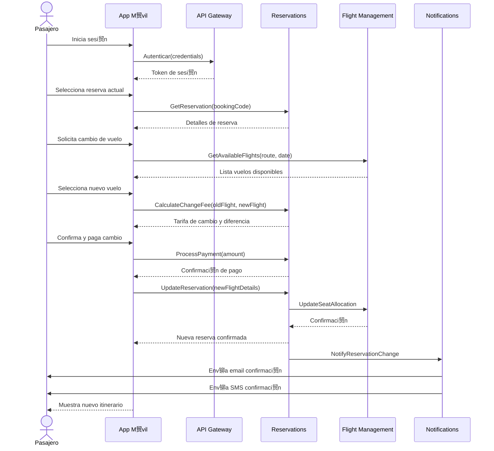
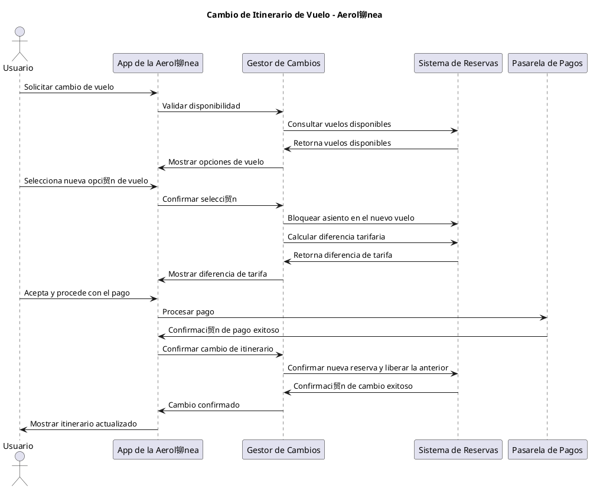
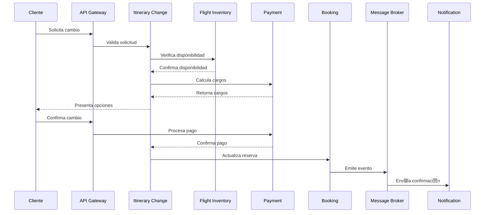
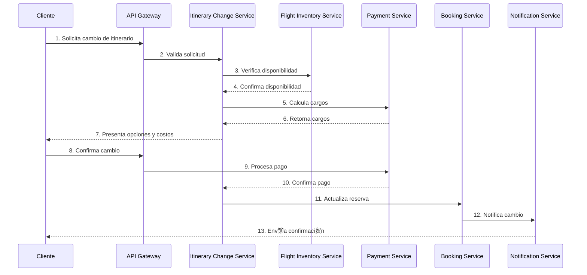

# Prompt 1: Dame un ejemplo de diagrama de secuencia en PlantUML de una app de cambio de itinerarios de vuelo de una aerolinea similar a Copa

## Claude

Crear茅 un diagrama de secuencia que muestre el proceso de cambio de itinerario de vuelo.



He creado un diagrama de secuencia que muestra el flujo completo de cambio de itinerario. El diagrama incluye:

1. Autenticaci贸n inicial del pasajero
2. Consulta de la reserva actual
3. B煤squeda de vuelos alternativos disponibles
4. C谩lculo de tarifas de cambio
5. Proceso de pago
6. Actualizaci贸n de la reserva
7. Notificaciones al pasajero

Los principales actores/sistemas son:

- Pasajero (usuario final)
- App M贸vil (interfaz de usuario)
- API Gateway (capa de servicios)
- Sistema de Reservaciones
- Sistema de Gesti贸n de Vuelos
- Sistema de Notificaciones

驴Te gustar铆a que modifique alguna parte del diagrama o que agregue alg煤n escenario adicional, como por ejemplo el manejo de errores o cancelaciones?

## ChatGPT

Aqu铆 tienes un ejemplo de **diagrama de secuencia en PlantUML** para una **app de cambio de itinerarios de vuelo** de una aerol铆nea similar a Copa Airlines.

### **Escenario:**

El usuario solicita un cambio de itinerario a trav茅s de la app, validando disponibilidad de vuelos y pagando la diferencia si es necesario.

---



---

### **Explicaci贸n del flujo:**

1. El usuario solicita un cambio de vuelo desde la app.
2. La app consulta la disponibilidad con el **Gestor de Cambios**, que a su vez consulta con el **Sistema de Reservas**.
3. Se muestra al usuario las opciones disponibles.
4. El usuario selecciona un nuevo vuelo y la app confirma la selecci贸n con el **Gestor de Cambios**.
5. El sistema bloquea el nuevo asiento y calcula la diferencia tarifaria.
6. Si hay diferencia de tarifa, el usuario debe realizar el pago a trav茅s de la **Pasarela de Pagos**.
7. Tras un pago exitoso, el sistema confirma el cambio y actualiza el itinerario.
8. La app muestra el nuevo itinerario al usuario.

---

Este diagrama cubre la l贸gica principal para una app de cambio de itinerarios en una aerol铆nea como Copa Airlines. 驴Necesitas agregar m谩s detalles o particularidades? 

# Prompt 2: Me puedes mostrar la grafica de ese lenguaje?

## Claude

No es necesario, Claude genero el diagrama desde el primer prompt.

## ChatGPT

Aqu铆 tienes el **diagrama de secuencia en PlantUML** generado a partir del c贸digo que compart铆:

Parece que no tengo la biblioteca necesaria para generar la imagen directamente. Sin embargo, puedes visualizar este diagrama f谩cilmente usando PlantUML de la siguiente manera:

### **M茅todo 1: Usando un editor online**

1. Copia el c贸digo PlantUML que te proporcion茅.
2. Ve a [PlantUML Online](https://www.plantuml.com/plantuml/uml/)
3. Pega el c贸digo y haz clic en "Submit" para ver el diagrama.

### **M茅todo 2: Usando una extensi贸n en VSCode**

1. Instala la extensi贸n **PlantUML** en VSCode.
2. Crea un archivo con extensi贸n `.puml`.
3. Pega el c贸digo en el archivo y usa `Alt + D` para generar la vista previa.

Si quieres que genere la imagen de otra manera, dime y lo intento de otra forma. 

## An谩lisis de la respuesta

Para la generaci贸n de diagramas Claude parece tener un mejor procesamiento de la solicitud. Se genero el codigo desde el primer prompt y adicional nos proporciono un preview.

ChatGPT aun despues del segundo prompt indicandole que nos mostrara el diagrama no fue capaz de hacerlo, sin embargo nos proporciono pasos con herramientas donde podriamos vizualizarlo.

# Prompt 3: Ahora ayudame a crear el diagrama de arquitectura utilizando la libreria Diagrams y Python para pintarla suponiendo que uso AWS.

## Claude

Te ayudar茅 a crear un diagrama de arquitectura usando la librer铆a Diagrams que muestre la infraestructura AWS para esta aplicaci贸n de cambio de itinerarios.

```python
from diagrams import Diagram, Cluster
from diagrams.aws.mobile import APIGateway
from diagrams.aws.compute import Lambda
from diagrams.aws.database import RDS, DynamoDB
from diagrams.aws.security import Cognito
from diagrams.aws.integration import SNS, SQS
from diagrams.aws.network import ELB
from diagrams.aws.storage import S3
from diagrams.aws.compute import ElasticContainerService as ECS
from diagrams.aws.network import CloudFront

with Diagram("Airline Flight Change Architecture", show=False):
    # Cliente y CDN
    cdn = CloudFront("CloudFront CDN")

    # Auth
    with Cluster("Authentication"):
        auth = Cognito("Cognito User Pool")

    # API Gateway y Load Balancer
    api = APIGateway("API Gateway")
    lb = ELB("Load Balancer")

    # Servicios en Contenedores
    with Cluster("Container Services"):
        services = [
            ECS("Reservation Service"),
            ECS("Flight Management"),
            ECS("Payment Service"),
            ECS("Notification Service")
        ]

    # Funciones Lambda
    with Cluster("Serverless Functions"):
        functions = [
            Lambda("Availability Calculator"),
            Lambda("Fee Calculator"),
            Lambda("Booking Updater")
        ]

    # Base de datos
    with Cluster("Databases"):
        reservation_db = RDS("Reservations DB")
        flight_db = RDS("Flights DB")
        cache = DynamoDB("Cache Layer")

    # Colas y Notificaciones
    with Cluster("Message Services"):
        queue = SQS("Processing Queue")
        notification = SNS("Notifications")

    # Storage
    docs = S3("Documents Storage")

    # Conexiones
    cdn >> api
    api >> auth
    api >> lb
    lb >> services
    services[0] >> functions[0]
    services[0] >> functions[1]
    services[0] >> functions[2]

    for service in services:
        service >> reservation_db
        service >> flight_db
        service >> cache

    services[3] >> notification
    services[0] >> queue

    for function in functions:
        function >> reservation_db
        function >> flight_db

    notification >> docs

```

Este c贸digo genera un diagrama de arquitectura AWS que incluye:

1. Capa de Frontend/Distribuci贸n:

   - CloudFront como CDN

2. Autenticaci贸n:

   - Cognito para gesti贸n de usuarios

3. API y Balanceo:

   - API Gateway
   - Elastic Load Balancer

4. Servicios Principales (en ECS):

   - Servicio de Reservaciones
   - Gesti贸n de Vuelos
   - Servicio de Pagos
   - Servicio de Notificaciones

5. Funciones Serverless:

   - Calculador de Disponibilidad
   - Calculador de Tarifas
   - Actualizador de Reservas

6. Bases de Datos:

   - RDS para Reservaciones
   - RDS para Vuelos
   - DynamoDB como capa de cach茅

7. Mensajer铆a:

   - SQS para procesamiento as铆ncrono
   - SNS para notificaciones

8. Almacenamiento:
   - S3 para documentos

Para ejecutar este c贸digo necesitar谩s:

1. Tener instalada la librer铆a Diagrams (`pip install diagrams`)
2. Tener Graphviz instalado en tu sistema
3. Guardar el c贸digo en un archivo .py y ejecutarlo

驴Te gustar铆a que modifique algo en la arquitectura o que agregue alg煤n componente adicional?

## ChatGPT

Parece que no tengo la biblioteca **Diagrams** instalada en este entorno, pero puedes generar el diagrama en tu m谩quina local siguiendo estos pasos:

### **1锔 Instalar la librer铆a**

Ejecuta este comando en tu terminal para instalar **Diagrams**:

```bash
pip install diagrams
```

### **2锔 C贸digo Python para generar el diagrama**

Guarda este c贸digo en un archivo `diagrama.py` y ejec煤talo:

```python
from diagrams import Diagram, Cluster
from diagrams.aws.compute import EC2
from diagrams.aws.database import RDS
from diagrams.aws.network import APIGateway
from diagrams.aws.integration import SQS
from diagrams.aws.security import Cognito
from diagrams.aws.storage import S3
from diagrams.aws.analytics import KinesisDataStreams
from diagrams.onprem.client import Users

# Crear el diagrama de arquitectura
with Diagram("Arquitectura de Cambio de Itinerario de Vuelo", show=True, direction="LR"):

    user = Users("Usuario")

    with Cluster("Front-end"):
        mobile_app = S3("App M贸vil")
        web_app = S3("Web App")

    with Cluster("Back-end en AWS"):
        api_gateway = APIGateway("API Gateway")
        auth = Cognito("Autenticaci贸n")

        with Cluster("Servicios de Aplicaci贸n"):
            flight_service = EC2("Gestor de Cambios de Vuelo")
            payment_service = EC2("Servicio de Pagos")

        with Cluster("Colas y Eventos"):
            sqs_queue = SQS("Cola de Mensajes")
            event_stream = KinesisDataStreams("Flujo de Eventos")

        with Cluster("Base de Datos"):
            reservations_db = RDS("Base de Datos de Reservas")

    # Conexiones
    user >> mobile_app
    user >> web_app

    mobile_app >> api_gateway
    web_app >> api_gateway

    api_gateway >> auth
    auth >> api_gateway

    api_gateway >> flight_service
    api_gateway >> payment_service

    flight_service >> sqs_queue
    sqs_queue >> event_stream

    flight_service >> reservations_db
    payment_service >> reservations_db
```

### **3锔 Ejecutar el script**

Corre el script con:

```bash
python diagrama.py
```

Esto generar谩 una imagen con la **arquitectura en AWS para la app de cambio de itinerarios de vuelo**.

D茅jame saber si necesitas modificaciones o mejoras en la arquitectura. 

Te describo las funcionalidades b谩sicas de un sistema de gesti贸n de reservas de aerol铆neas, ordenadas por prioridad:

1. **Gesti贸n de inventario de vuelos**

   - Control de asientos disponibles en tiempo real
   - Gesti贸n de rutas y frecuencias
   - Control de capacidad por clase (econ贸mica, business, primera)

2. **Motor de reservas**

   - B煤squeda de vuelos disponibles
   - Proceso de reserva de asientos
   - C谩lculo din谩mico de tarifas
   - Gesti贸n de conexiones entre vuelos

3. **Gesti贸n de pasajeros**

   - Registro de datos personales
   - Documentaci贸n de viaje
   - Historial de reservas
   - Programas de fidelizaci贸n

4. **Sistema de pagos**

   - Procesamiento de pagos
   - Gesti贸n de reembolsos
   - M煤ltiples m茅todos de pago
   - Facturaci贸n

5. **Check-in y gesti贸n de embarque**

   - Check-in online y en aeropuerto
   - Asignaci贸n de asientos
   - Gesti贸n de equipaje
   - Emisi贸n de tarjetas de embarque

6. **Gesti贸n de cambios y cancelaciones**

   - Modificaci贸n de reservas
   - Pol铆ticas de cancelaci贸n
   - C谩lculo de penalizaciones
   - Reubicaci贸n en otros vuelos

7. **Reporting y an谩lisis**

   - Ocupaci贸n de vuelos
   - Ingresos por ruta
   - An谩lisis de tendencias
   - Reportes operativos

8. **Integraci贸n con otros sistemas**

   - GDS (Global Distribution Systems)
   - Sistemas de control de operaciones
   - APIs para terceros
   - Sistemas de meteorolog铆a

9. **Gesti贸n de servicios adicionales**

   - Selecci贸n de comidas
   - Servicios especiales
   - Upgrade de clase
   - Venta de servicios auxiliares

10. **Comunicaci贸n con pasajeros**
    - Notificaciones de vuelo
    - Alertas de cambios
    - Confirmaciones de reserva
    - Comunicaci贸n de incidencias

Te detallo los principales beneficios para el cliente al usar un sistema de gesti贸n de reservas de aerol铆neas:

1. **Conveniencia y Accesibilidad**

   - Reservas 24/7 desde cualquier dispositivo
   - Eliminaci贸n de necesidad de visitar agencias f铆sicas
   - Acceso inmediato a toda la informaci贸n de vuelos
   - Gesti贸n aut贸noma de sus reservas

2. **Ahorro de Tiempo**

   - Proceso de reserva r谩pido y simplificado
   - Check-in online anticipado
   - Comparaci贸n instant谩nea de opciones de vuelo
   - Actualizaci贸n autom谩tica de informaci贸n

3. **Ahorro de Dinero**

   - Acceso a ofertas y promociones especiales
   - Comparaci贸n f谩cil de tarifas
   - Visibilidad de fechas con mejores precios
   - Acumulaci贸n de puntos/millas de fidelizaci贸n

4. **Mayor Control y Flexibilidad**

   - Selecci贸n de asientos en tiempo real
   - Modificaci贸n de reservas online
   - Gesti贸n de preferencias personales
   - Cancelaciones autoservicio

5. **Mejor Experiencia de Viaje**

   - Notificaciones proactivas sobre el vuelo
   - Informaci贸n actualizada sobre cambios
   - Gesti贸n digital de documentos de viaje
   - Personalizaci贸n de servicios adicionales

6. **Transparencia**

   - Informaci贸n clara sobre precios y condiciones
   - Desglose detallado de costos
   - Visibilidad del estado de la reserva
   - Pol铆ticas de cambio y cancelaci贸n claras

7. **Seguridad y Confianza**

   - Confirmaci贸n inmediata de reservas
   - Almacenamiento seguro de datos personales
   - Historial de transacciones accesible
   - Pagos seguros online

8. **Servicios Personalizados**

   - Recomendaciones basadas en preferencias
   - Ofertas personalizadas
   - Recordatorios autom谩ticos
   - Atenci贸n a necesidades especiales

9. **Integraci贸n con Otros Servicios**

   - Reserva de servicios adicionales (hotel, coche)
   - Conexi贸n con programas de fidelizaci贸n
   - Integraci贸n con calendarios personales
   - Compartir itinerarios f谩cilmente

10. **Soporte Post-Venta**
    - Acceso a atenci贸n al cliente 24/7
    - Gesti贸n de reclamaciones online
    - Seguimiento de equipaje
    - Feedback y valoraciones

Estos beneficios contribuyen a:

- Mejorar la satisfacci贸n del cliente
- Aumentar la lealtad a la aerol铆nea
- Reducir la fricci贸n en el proceso de compra
- Proporcionar una experiencia de viaje m谩s fluida y agradable

Te describo el customer journey t铆pico de un cliente que utiliza un sistema de gesti贸n de reservas de aerol铆neas, desde la planificaci贸n hasta el post-viaje:

### 1. Fase de Planificaci贸n

- **B煤squeda inicial**

  - Ingreso al sitio web/app de la aerol铆nea
  - Introducci贸n de criterios de b煤squeda (origen, destino, fechas, pasajeros)
  - Exploraci贸n de diferentes opciones de vuelos
  - Comparaci贸n de precios y horarios

- **Selecci贸n de vuelo**
  - Revisi贸n de detalles del vuelo (duraci贸n, escalas, tipo de avi贸n)
  - Verificaci贸n de tarifas y condiciones
  - Selecci贸n de clase de viaje
  - Revisi贸n de servicios incluidos

### 2. Fase de Reserva

- **Proceso de reserva**

  - Selecci贸n de asientos
  - Ingreso de datos de pasajeros
  - A帽adir servicios adicionales (equipaje extra, comidas especiales)
  - Selecci贸n de m茅todo de pago

- **Confirmaci贸n**
  - Revisi贸n final de la reserva
  - Proceso de pago
  - Recepci贸n de confirmaci贸n por email
  - Almacenamiento de reserva en cuenta personal

### 3. Pre-vuelo

- **Preparaci贸n**

  - Recepci贸n de recordatorios del vuelo
  - Check-in online (24-48h antes)
  - Selecci贸n/confirmaci贸n de asiento
  - Descarga de tarjeta de embarque

- **Gesti贸n de cambios (si necesario)**
  - Modificaci贸n de horarios/fechas
  - Actualizaci贸n de servicios especiales
  - Gesti贸n de cancelaciones
  - Solicitud de reembolsos

### 4. D铆a del Vuelo

- **En el aeropuerto**

  - Check-in en mostrador (si no se hizo online)
  - Facturaci贸n de equipaje
  - Paso por seguridad usando boarding pass
  - Monitoreo de estado del vuelo

- **Pre-embarque**
  - Localizaci贸n de puerta de embarque
  - Recepci贸n de actualizaciones de vuelo
  - Gesti贸n de cambios de 煤ltima hora
  - Embarque seg煤n grupo asignado

### 5. Durante el Vuelo

- **Servicios a bordo**
  - Acceso a servicios reservados
  - Compras a bordo
  - Uso de entretenimiento
  - Registro de incidencias

### 6. Post-Vuelo

- **Llegada**

  - Recogida de equipaje
  - Notificaci贸n de llegada de equipaje
  - Reporte de incidencias (si las hay)

- **Seguimiento**
  - Acumulaci贸n de puntos/millas
  - Encuesta de satisfacci贸n
  - Actualizaci贸n del historial de viajes
  - Recepci贸n de ofertas personalizadas

### Puntos de Contacto Digital

Durante todo el journey, el cliente interact煤a con:

- Sitio web de la aerol铆nea
- Aplicaci贸n m贸vil
- Emails automatizados
- SMS/Notificaciones push
- Quioscos de autoservicio
- Pantallas de informaci贸n
- Chatbots/Asistentes virtuales

### Momentos Cr铆ticos

Los momentos m谩s importantes donde el sistema debe ser especialmente eficiente:

1. B煤squeda y reserva inicial
2. Proceso de pago
3. Check-in online
4. Notificaciones de cambios
5. Gesti贸n de incidencias

Este journey puede variar seg煤n:

- Tipo de viaje (dom茅stico/internacional)
- Pol铆tica de la aerol铆nea
- Nivel de digitalizaci贸n
- Servicios contratados
- Programa de fidelizaci贸n del cliente

Te detallo los casos de uso m谩s importantes para un MVP de gesti贸n de cambios de itinerario, ordenados por prioridad y agrupados por funcionalidad:

### 1. Consulta de Reserva

1. **Buscar Reserva**

   - Input: C贸digo de reserva + Apellido/Email
   - Output: Detalles de la reserva actual
   - Validaci贸n de que la reserva existe y est谩 activa

2. **Verificar Elegibilidad de Cambio**
   - Validar si la reserva permite cambios
   - Verificar estado del vuelo (no iniciado/completado)
   - Comprobar restricciones de la tarifa

### 2. B煤squeda de Alternativas

3. **Buscar Vuelos Alternativos**

   - Por cambio de fecha (mismo origen-destino)
   - Por cambio de ruta (nuevo destino)
   - Mostrar disponibilidad y tarifas

4. **Calcular Diferencias de Tarifa**
   - C谩lculo de diferencial de precio
   - C谩lculo de penalizaciones aplicables
   - Mostrar costo total del cambio

### 3. Proceso de Cambio

5. **Seleccionar Nueva Opci贸n**

   - Selecci贸n del nuevo vuelo
   - Confirmaci贸n de nuevos horarios
   - Vista previa del cambio

6. **Procesar Pago de Diferencias**

   - Gesti贸n del pago adicional (si aplica)
   - Proceso de reembolso (si aplica)
   - Confirmaci贸n de transacci贸n

7. **Confirmar Cambio**
   - Actualizaci贸n de la reserva
   - Generaci贸n de nuevo itinerario
   - Cancelaci贸n del vuelo anterior

### 4. Notificaciones

8. **Enviar Confirmaciones**
   - Email de confirmaci贸n del cambio
   - Nuevo itinerario en PDF
   - Comprobante de cargo/reembolso

### 5. Gesti贸n de Errores

9. **Manejar Fallos**
   - Reversi贸n de cambios fallidos
   - Notificaci贸n de errores
   - Log de intentos fallidos

### Consideraciones T茅cnicas Importantes:

- Manejo de concurrencia en reservas
- Consistencia en el inventario de asientos
- Registro de auditor铆a de cambios
- Timeout en sesiones de cambio
- Validaci贸n de reglas de negocio
- Integraci贸n con sistema de pagos
- Gesti贸n de estados de la transacci贸n

### Datos M铆nimos Necesarios:

1. **Reserva**

   - C贸digo de reserva
   - Estado
   - Pasajeros
   - Vuelos actuales
   - Tarifa aplicada

2. **Vuelo**

   - N煤mero de vuelo
   - Origen/Destino
   - Fecha/Hora
   - Disponibilidad
   - Precios

3. **Cambio**
   - ID de transacci贸n
   - Tipo de cambio
   - Diferencial de precio
   - Estado del cambio
   - Timestamp

Este MVP proporcionar铆a la funcionalidad b谩sica necesaria para gestionar cambios de itinerario, manteniendo la integridad de las reservas y asegurando una experiencia de usuario aceptable.

Te propongo un diagrama de casos de uso en PlantUML que representa la funcionalidad del MVP, diferenciando entre usuarios visitantes y logueados:


Este diagrama muestra:

1. **Actores**:

   - Usuario Visitante: Puede realizar operaciones b谩sicas sin autenticaci贸n
   - Usuario Logueado: Tiene acceso a todas las funcionalidades
   - Sistema de Pagos: Sistema externo para procesar pagos
   - Sistema de Reservas: Sistema externo para gestionar reservas

2. **Casos de Uso**:

   - Organizados en secuencia l贸gica de operaci贸n
   - Con relaciones de extensi贸n (<<extend>>) para funcionalidades opcionales
   - Con relaciones de inclusi贸n (<<include>>) para funcionalidades requeridas

3. **Notas**:

   - Detalles importantes sobre casos de uso clave
   - Validaciones y c谩lculos relevantes

4. **Relaciones**:

   - Muestra claramente qu茅 puede hacer cada tipo de usuario
   - Indica la interacci贸n con sistemas externos
   - Establece el flujo l贸gico de operaciones

5. **Agrupaci贸n**:
   - Todo contenido en un sistema rectangular que representa el alcance del MVP
   - Clara separaci贸n de responsabilidades

El diagrama sigue las buenas pr谩cticas de UML:

- Nombres descriptivos y concisos
- Relaciones claramente definidas
- Uso apropiado de estereotipos
- Agrupaci贸n l贸gica de funcionalidades
- Inclusi贸n de sistemas externos relevantes
- Notas explicativas en casos clave

Te ayudo con un modelo b谩sico para un sistema de cambio de itinerarios a茅reos. Aqu铆 est谩n las 3 entidades fundamentales:

1. **Reserva (Booking)**

   - ID_Reserva (PK)
   - ID_Cliente (FK)
   - Estado (confirmada, pendiente, cancelada)
   - Fecha_Creaci贸n
   - Precio_Total
   - N煤mero_Pasajeros
   - C贸digo_Reserva (alfanum茅rico para el cliente)

2. **Vuelo (Flight)**

   - ID_Vuelo (PK)
   - N煤mero_Vuelo
   - ID_Aerol铆nea
   - Origen
   - Destino
   - Fecha_Salida
   - Hora_Salida
   - Fecha_Llegada
   - Hora_Llegada
   - Capacidad_Total
   - Asientos_Disponibles
   - Estado (programado, retrasado, cancelado)

3. **Segmento_Reserva (BookingSegment)**
   - ID_Segmento (PK)
   - ID_Reserva (FK)
   - ID_Vuelo (FK)
   - Estado_Segmento
   - N煤mero_Asiento
   - Clase_Servicio (econ贸mica, business, primera)
   - Precio_Segmento

**Relaciones:**

- Una **Reserva** puede tener m煤ltiples **Segmentos_Reserva** (relaci贸n 1:N) para manejar vuelos con escalas
- Cada **Segmento_Reserva** est谩 asociado a un 煤nico **Vuelo** (relaci贸n N:1)
- La entidad **Segmento_Reserva** act煤a como una tabla de uni贸n que permite rastrear qu茅 vuelos espec铆ficos forman parte de una reserva

Esta estructura permite:

- Gestionar cambios de itinerario modificando los segmentos
- Mantener un historial de cambios
- Manejar reservas con m煤ltiples vuelos
- Controlar la disponibilidad de asientos
- Calcular diferencias de precio en cambios de itinerario

Como arquitecto de software, te ayudar茅 a identificar las 3 entidades fundamentales para un sistema de cambio de itinerarios en reservas aerol铆neas, sus campos esenciales y sus relaciones:

1. **Reserva (Booking)**

   - `booking_id` (Identificador 煤nico)
   - `passenger_id` (Relaci贸n con el pasajero)
   - `booking_status` (Confirmada, Pendiente, Cancelada)
   - `booking_date` (Fecha de la reserva)
   - `total_amount` (Monto total)
   - `currency` (Moneda)
   - `payment_status` (Estado del pago)

2. **Itinerario (Itinerary)**

   - `itinerary_id` (Identificador 煤nico)
   - `booking_id` (Relaci贸n con la reserva)
   - `original_flight_id` (Vuelo original)
   - `new_flight_id` (Vuelo nuevo en caso de cambio)
   - `change_fee` (Cargo por cambio)
   - `change_status` (Pendiente, Aprobado, Rechazado)
   - `change_date` (Fecha del cambio)
   - `reason` (Motivo del cambio)

3. **Vuelo (Flight)**
   - `flight_id` (Identificador 煤nico)
   - `flight_number` (N煤mero de vuelo)
   - `origin_airport` (Aeropuerto de salida)
   - `destination_airport` (Aeropuerto de llegada)
   - `departure_datetime` (Fecha y hora de salida)
   - `arrival_datetime` (Fecha y hora de llegada)
   - `available_seats` (Asientos disponibles)
   - `fare_class` (Clase de tarifa)
   - `aircraft_id` (Identificador de la aeronave)

**Relaciones entre las entidades:**

1. **Reserva - Itinerario (1:N)**

   - Una reserva puede tener m煤ltiples itinerarios (en caso de vuelos con escalas o cambios hist贸ricos)
   - Cada itinerario pertenece a una 煤nica reserva

2. **Itinerario - Vuelo (N:2)**

   - Cada itinerario est谩 relacionado con hasta dos vuelos:
     - El vuelo original
     - El vuelo nuevo (en caso de cambio)
   - Un vuelo puede estar asociado a m煤ltiples itinerarios

3. **Reserva - Vuelo (M:N)**
   - Una reserva puede incluir m煤ltiples vuelos
   - Un vuelo puede estar asociado a m煤ltiples reservas

**Consideraciones adicionales:**

- Es importante mantener un historial de cambios en los itinerarios para auditor铆a
- Se deben considerar las pol铆ticas de cambio y tarifas asociadas
- El sistema debe manejar la disponibilidad de asientos en tiempo real
- Se debe considerar la gesti贸n de listas de espera para vuelos llenos
- Es crucial mantener la integridad referencial entre las entidades

Este modelo de datos proporciona la base necesaria para gestionar de manera eficiente los cambios de itinerario, manteniendo la trazabilidad y permitiendo una gesti贸n efectiva de las modificaciones en las reservas.

Entiendo que ya tienes definido el modelo de datos base y ahora necesitas una visi贸n m谩s completa de la arquitectura del sistema. Te ayudar茅 a dise帽ar una arquitectura robusta para el sistema de cambio de itinerarios.

**1. Arquitectura General (Patr贸n de Microservicios)**

Propongo los siguientes servicios principales:

1. **Booking Service (Servicio de Reservas)**

   - Gesti贸n del ciclo de vida de las reservas
   - Validaci贸n de disponibilidad
   - C谩lculo de tarifas y cargos
   - API endpoints:
     - `POST /bookings` (crear reserva)
     - `GET /bookings/{id}` (consultar reserva)
     - `PUT /bookings/{id}/status` (actualizar estado)

2. **Itinerary Change Service (Servicio de Cambios)**

   - Gesti贸n de solicitudes de cambio
   - Validaci贸n de reglas de negocio para cambios
   - C谩lculo de diferencias tarifarias
   - API endpoints:
     - `POST /changes/request` (solicitar cambio)
     - `GET /changes/{id}` (consultar estado del cambio)
     - `PUT /changes/{id}/confirm` (confirmar cambio)

3. **Flight Inventory Service (Servicio de Inventario)**

   - Gesti贸n de disponibilidad de vuelos
   - Control de asientos
   - Bloqueo temporal de inventario
   - API endpoints:
     - `GET /flights/availability`
     - `POST /flights/hold`
     - `PUT /flights/release`

4. **Payment Service (Servicio de Pagos)**
   - Procesamiento de pagos
   - Reembolsos
   - Cargos por cambio
   - API endpoints:
     - `POST /payments`
     - `POST /refunds`
     - `GET /payments/{id}`

**2. Componentes de Infraestructura**

- **API Gateway**

  - Enrutamiento
  - Rate limiting
  - Autenticaci贸n/Autorizaci贸n
  - Logging

- **Message Broker (Kafka/RabbitMQ)**

  - Comunicaci贸n as铆ncrona entre servicios
  - Eventos de cambio de estado
  - Notificaciones

- **Cache Distribuida (Redis)**

  - Cach茅 de disponibilidad
  - Bloqueos temporales
  - Sesiones de usuario

- **Base de Datos**
  - PostgreSQL para datos transaccionales
  - MongoDB para logs y auditor铆a

**3. Flujo de Cambio de Itinerario**



**4. Consideraciones de Dise帽o**

1. **Resiliencia**

   - Circuit breakers
   - Retry policies
   - Fallbacks
   - Timeouts configurables

2. **Escalabilidad**

   - Servicios stateless
   - Cach茅 distribuida
   - Sharding de bases de datos
   - Auto-scaling

3. **Consistencia**

   - Saga pattern para transacciones distribuidas
   - Compensating transactions
   - Event sourcing

4. **Monitoreo**
   - Distributed tracing
   - M茅tricas de negocio
   - Health checks
   - Logs centralizados

**5. Aspectos de Seguridad**

- JWT para autenticaci贸n
- HTTPS/TLS para todas las comunicaciones
- Encriptaci贸n de datos sensibles
- Rate limiting por API key
- Auditor铆a de cambios

**6. Consideraciones de Implementaci贸n**

1. **Tecnolog铆as Sugeridas**

   - Backend: Spring Boot/Node.js
   - Base de Datos: PostgreSQL
   - Cache: Redis
   - Message Broker: Kafka
   - API Gateway: Kong/Netflix Zuul

2. **Pr谩cticas DevOps**
   - CI/CD pipelines
   - Infrastructure as Code
   - Containerization (Docker)
   - Orchestration (Kubernetes)

驴Te gustar铆a que profundicemos en alg煤n aspecto espec铆fico de la arquitectura? Podemos explorar en detalle:

- Patrones de dise帽o espec铆ficos
- Flujos de datos
- Estrategias de cach茅
- Manejo de errores
- Estrategias de deployment
- Cualquier otro aspecto que consideres relevante

Te generar茅 varios diagramas Mermaid que representan diferentes vistas de la arquitectura del sistema.

**1. Diagrama de Componentes y Servicios**


**2. Diagrama de Flujo de Cambio de Itinerario**



**3. Diagrama de Modelo de Datos**


**4. Diagrama de Estados de Cambio de Itinerario**


**5. Diagrama de Despliegue**


Estos diagramas proporcionan diferentes vistas de la arquitectura:

1. El diagrama de componentes muestra la estructura general del sistema
2. El diagrama de secuencia ilustra el flujo de un cambio de itinerario
3. El diagrama ERD muestra las relaciones entre las entidades principales
4. El diagrama de estados muestra el ciclo de vida de un cambio de itinerario
5. El diagrama de despliegue muestra la infraestructura cloud

驴Te gustar铆a que profundicemos en alg煤n aspecto espec铆fico de estos diagramas o que generemos alguna vista adicional del sistema?


### Realizaci贸n de la primera historia de usuario

US-01: Consulta de Reserva Actual 
Descripci贸n 

Como pasajero 

Quiero ingresar mi c贸digo de reserva y apellido 

Para poder consultar los detalles de mi reserva actual 

Contexto del Negocio 

Es el punto de entrada principal para cualquier gesti贸n de cambios de itinerario 
La validaci贸n correcta protege la privacidad de los datos del pasajero 
Debe funcionar tanto para usuarios registrados como no registrados 
Precondiciones 

La reserva debe existir en el sistema 
La reserva no debe estar cancelada o expirada 
El sistema de reservas debe estar operativo 
La conexi贸n con el sistema central de reservas debe estar activa 
Datos de Entrada 

C贸digo de reserva (6 caracteres alfanum茅ricos) 
Apellido del pasajero principal 
Email (opcional, para env铆o de informaci贸n) 
Flujo Principal 

El pasajero accede a la pantalla de consulta de reserva 
Ingresa el c贸digo de reserva 
Ingresa su apellido 
El sistema valida los datos ingresados 
El sistema muestra los detalles de la reserva 
Datos a Mostrar 

Informaci贸n del vuelo: 
N煤mero de vuelo 
Origen y destino 
Fecha y hora de salida/llegada 
Terminal y puerta (si est谩n disponibles) 
Informaci贸n de la reserva: 
Estado actual 
Clase de servicio 
Restricciones de la tarifa 
N煤mero de pasajeros 
Servicios adicionales contratados 
Informaci贸n de contacto registrada 
Reglas de Negocio 

El c贸digo de reserva debe tener exactamente 6 caracteres 
El apellido debe coincidir exactamente con el registrado 
Mostrar error si la combinaci贸n no es v谩lida 
Bloquear acceso despu茅s de 3 intentos fallidos 
La sesi贸n expira despu茅s de 15 minutos de inactividad 
Flujos Alternativos 

Reserva no encontrada: 
Mostrar mensaje de error claro 
Sugerir verificar los datos 
Ofrecer contacto con servicio al cliente 
Sistema no disponible: 
Mostrar mensaje de error amigable 
Sugerir intentar m谩s tarde 
Proporcionar n煤mero de contacto alternativo 
Criterios de Aceptaci贸n 

Validaci贸n de Datos: 
Validar formato del c贸digo de reserva 
Validar que el apellido solo contenga caracteres permitidos 
Mostrar mensajes de error espec铆ficos para cada validaci贸n 
Seguridad: 
Implementar protecci贸n contra ataques de fuerza bruta 
Registrar todos los intentos de acceso 
Encriptar datos sensibles en tr谩nsito 
Rendimiento: 
Tiempo de respuesta < 2 segundos 
Soportar 1000 consultas simult谩neas 
Disponibilidad 99.9% 
Interfaz: 
Dise帽o responsive 
Accesible en dispositivos m贸viles 
Cumplir con est谩ndares de UX de la aerol铆nea 
Mockups/Enlaces 

Link al dise帽o en Figma: [pendiente] 
Link a la documentaci贸n API: [pendiente] 
Dependencias T茅cnicas 

Integraci贸n con sistema central de reservas 
Servicio de autenticaci贸n 
Sistema de logging y monitoreo 
API de notificaciones para errores cr铆ticos 
Consideraciones de Testing 

Pruebas unitarias para validaciones 
Pruebas de integraci贸n con sistema de reservas 
Pruebas de carga para concurrencia 
Pruebas de seguridad 
Pruebas de usabilidad 
M茅tricas de xito 

Tasa de 茅xito en consultas > 98% 
Tiempo promedio de consulta < 2 segundos 
Tasa de errores < 1% 
Satisfacci贸n del usuario > 4.5/5 
Notas Adicionales 

Considerar futura integraci贸n con sistemas de login social 
Preparar para soporte multiidioma 
Planear capacidad de b煤squeda por email en futuras versiones 

### Tickets de Jira
Crea la primera historia de este sistema:

Backend: Implementaci贸n de API para Consulta de Reservas 
ID del Ticket: BK-001 

T铆tulo del Ticket: Implementar API para consultar detalles de una reserva 

Descripci贸n: Se debe desarrollar un endpoint en el backend que permita consultar la informaci贸n de una reserva mediante el c贸digo de reserva y apellido o correo electr贸nico. La API deber谩 validar la existencia de la reserva y devolver los datos correspondientes. 

Criterios de Aceptaci贸n: 

El endpoint debe aceptar c贸digo de reserva y apellido/email como par谩metros. 
Si la reserva existe, debe devolver un JSON con los detalles de la reserva. 
Si la reserva no existe, debe devolver un mensaje de error adecuado. 
El endpoint debe responder en menos de 3 segundos. 
La API debe estar protegida con autenticaci贸n y HTTPS. 
Prioridad: Alta 

Estimaci贸n de esfuerzo: 8 horas 

Tareas T茅cnicas: 

Crear el endpoint GET /reservas/{codigoReserva} en el servicio de reservas. 
Implementar l贸gica de b煤squeda en la base de datos. 
Validar existencia de la reserva y su estado. 
Aplicar formato de respuesta JSON. 
Manejar errores y mensajes adecuados. 
Implementar logs para trazabilidad. 
Notas: La API debe integrarse con el servicio de autenticaci贸n para verificar permisos de acceso. 

Backend: Seguridad y Validaciones 
ID del Ticket: BK-002 

T铆tulo del Ticket: Implementar validaciones y seguridad en la API de consulta de reserva 

Descripci贸n: Se deben agregar validaciones de entrada, autenticaci贸n y protecci贸n contra ataques como inyecci贸n SQL y fuerza bruta. 

Criterios de Aceptaci贸n: 

Los par谩metros de entrada deben ser validados antes de la consulta en la base de datos. 
Implementaci贸n de autenticaci贸n con JWT o API Key. 
Prevenci贸n contra ataques de fuerza bruta (rate limiting). 
Manejo de errores con c贸digos HTTP adecuados. 
Prioridad: Alta 

Estimaci贸n de esfuerzo: 5 horas 

Tareas T茅cnicas: 

Validar c贸digo de reserva y apellido/email con expresiones regulares. 
Implementar middleware de autenticaci贸n con JWT/API Key. 
Configurar rate limiting con un m谩ximo de intentos por minuto. 
Configurar logs de intentos fallidos para auditor铆a. 
Notas: Esta tarea debe completarse antes de exponer la API en producci贸n. 

 

Base de Datos: Optimizaci贸n de Consulta de Reserva 
ID del Ticket: DB-001 

T铆tulo del Ticket: Optimizar consulta de reservas en la base de datos 

Descripci贸n: Se debe optimizar la consulta a la base de datos para garantizar un tiempo de respuesta menor a 3 segundos. 

Criterios de Aceptaci贸n: 

La consulta debe realizarse en menos de 3 segundos en condiciones normales. 
Se deben agregar 铆ndices en los campos clave (c贸digo de reserva, apellido/email). 
La consulta debe devolver solo los datos necesarios para la visualizaci贸n. 
Prioridad: Media 

Estimaci贸n de esfuerzo: 4 horas 

Tareas T茅cnicas: 

Agregar 铆ndices en la base de datos en las columnas codigo_reserva y email_pasajero. 
Optimizar la consulta eliminando columnas innecesarias. 
Implementar cach茅 en Redis para consultas repetidas. 
Notas: Se recomienda revisar m茅tricas de rendimiento tras la implementaci贸n. 

 

Frontend: Dise帽o e Implementaci贸n del Formulario de Consulta 
 

ID del Ticket: FE-001 

T铆tulo del Ticket: Crear formulario de consulta de reserva en frontend 

Descripci贸n: Se debe desarrollar un formulario en la web donde el usuario pueda ingresar su c贸digo de reserva y apellido/email para consultar los detalles de su reserva. 

Criterios de Aceptaci贸n: 

El formulario debe permitir ingresar c贸digo de reserva y apellido/email. 
Debe haber validaci贸n en el frontend antes de enviar la solicitud. 
Debe mostrar un mensaje de error si la reserva no existe. 
El resultado debe mostrarse de manera clara y legible. 
Prioridad: Alta 

Estimaci贸n de esfuerzo: 6 horas 

Tareas T茅cnicas: 

Dise帽ar el formulario con React/Vue/Angular. 
Implementar validaciones en tiempo real. 
Conectar el formulario con la API de consulta de reservas. 
Manejar errores y mostrar mensajes adecuados. 
Notas: Debe ser responsive y accesible en dispositivos m贸viles. 

 

Frontend: Mostrar Detalles de la Reserva 
ID del Ticket: FE-002 

T铆tulo del Ticket: Implementar visualizaci贸n de detalles de la reserva 

Descripci贸n: Una vez consultada la reserva, se debe mostrar la informaci贸n de manera estructurada y legible. 

Criterios de Aceptaci贸n: 

Se deben mostrar los datos principales de la reserva (n煤mero de vuelo, fechas, estado, servicios contratados). 
La interfaz debe ser responsive. 
Debe haber una opci贸n para regresar a la pantalla de b煤squeda. 
Si hay un error, debe mostrarse un mensaje claro. 
Prioridad: Media 

Estimaci贸n de esfuerzo: 4 horas 

Tareas T茅cnicas: 

Dise帽ar la interfaz para mostrar los detalles de la reserva. 
Implementar formato de visualizaci贸n atractivo y claro. 
Agregar bot贸n de regreso a la pantalla de consulta. 
Notas: Se recomienda seguir los lineamientos de UI/UX del proyecto. 

 

Pruebas: Testing de la Funcionalidad Completa 
ID del Ticket: QA-001 

T铆tulo del Ticket: Realizar pruebas de consulta de reserva en backend y frontend 

Descripci贸n: Se deben realizar pruebas unitarias y de integraci贸n para validar que la consulta de reserva funciona correctamente. 

Criterios de Aceptaci贸n: 

Todas las pruebas unitarias deben pasar con 茅xito. 
Se deben cubrir casos de 茅xito y error en la consulta de reserva. 
Se debe probar el rendimiento de la API. 
Prioridad: Alta 

Estimaci贸n de esfuerzo: 5 horas 

Tareas T茅cnicas: 

Escribir pruebas unitarias para la API de consulta de reserva. 
Escribir pruebas de integraci贸n entre frontend y backend. 
Realizar pruebas de carga en la API. 
Notas: Se recomienda automatizar las pruebas en CI/CD. 

Resumen de Esfuerzo Total 

Backend (API + Seguridad): 13 horas 
Base de Datos: 4 horas 
Frontend (UI + Conexi贸n con API): 10 horas 
Pruebas: 5 horas 
Total estimado: 32 horas (~4 d铆as de trabajo para un equipo de 2-3 personas). 

### Resultado

Vamos a agregar internacionalizaci贸n (i18n) y estados de carga (loading states) a nuestra aplicaci贸n.

Primero, instalemos las dependencias necesarias:

```diff:frontend/package.json
  "dependencies": {
    "@emotion/react": "^11.10.6",
    "@emotion/styled": "^11.10.6",
    "@mui/icons-material": "^5.11.14",
    "@mui/material": "^5.11.14",
    "axios": "^1.3.4",
    "date-fns": "^2.29.3",
    "formik": "^2.2.9",
+   "i18next": "^22.4.13",
+   "i18next-browser-languagedetector": "^7.0.1",
+   "react-i18next": "^12.2.0",
    "react": "^18.2.0",
    "react-dom": "^18.2.0",
    "react-scripts": "5.0.1",
    "react-transition-group": "^4.4.5",
    "yup": "^1.0.2"
  }
```

Creemos los archivos de internacionalizaci贸n:

```javascript:frontend/src/i18n/index.js
import i18n from 'i18next';
import { initReactI18next } from 'react-i18next';
import LanguageDetector from 'i18next-browser-languagedetector';
import es from './locales/es.json';
import en from './locales/en.json';

i18n
  .use(LanguageDetector)
  .use(initReactI18next)
  .init({
    resources: {
      es: {
        translation: es
      },
      en: {
        translation: en
      }
    },
    fallbackLng: 'es',
    interpolation: {
      escapeValue: false
    }
  });

export default i18n;
```

```json:frontend/src/i18n/locales/es.json
{
  "search": {
    "title": "Consulta tu Reserva",
    "reservationCode": "C贸digo de Reserva",
    "lastName": "Apellido",
    "email": "Email",
    "searchButton": "Buscar Reserva",
    "validation": {
      "requiredCode": "El c贸digo de reserva es requerido",
      "minCode": "El c贸digo debe tener al menos {{min}} caracteres",
      "maxCode": "El c贸digo no debe exceder {{max}} caracteres",
      "requiredField": "Debe proporcionar apellido o email",
      "invalidEmail": "Email inv谩lido"
    }
  },
  "details": {
    "title": "Detalles de la Reserva",
    "reservationCode": "C贸digo de Reserva",
    "flightNumber": "N煤mero de Vuelo",
    "departureDate": "Fecha de Salida",
    "returnDate": "Fecha de Retorno",
    "services": "Servicios Contratados",
    "backButton": "Volver a la B煤squeda",
    "status": {
      "CONFIRMED": "Confirmada",
      "CANCELLED": "Cancelada",
      "PENDING": "Pendiente"
    }
  },
  "errors": {
    "notFound": "Reserva no encontrada",
    "default": "Error al buscar la reserva",
    "network": "Error de conexi贸n. Por favor, verifica tu conexi贸n a internet"
  }
}
```

```json:frontend/src/i18n/locales/en.json
{
  "search": {
    "title": "Check your Reservation",
    "reservationCode": "Reservation Code",
    "lastName": "Last Name",
    "email": "Email",
    "searchButton": "Search Reservation",
    "validation": {
      "requiredCode": "Reservation code is required",
      "minCode": "Code must be at least {{min}} characters",
      "maxCode": "Code must not exceed {{max}} characters",
      "requiredField": "You must provide last name or email",
      "invalidEmail": "Invalid email"
    }
  },
  "details": {
    "title": "Reservation Details",
    "reservationCode": "Reservation Code",
    "flightNumber": "Flight Number",
    "departureDate": "Departure Date",
    "returnDate": "Return Date",
    "services": "Contracted Services",
    "backButton": "Back to Search",
    "status": {
      "CONFIRMED": "Confirmed",
      "CANCELLED": "Cancelled",
      "PENDING": "Pending"
    }
  },
  "errors": {
    "notFound": "Reservation not found",
    "default": "Error searching for reservation",
    "network": "Connection error. Please check your internet connection"
  }
}
```

Creemos un componente de carga:

```javascript:frontend/src/components/common/LoadingOverlay.jsx
import React from 'react';
import { Backdrop, CircularProgress, Typography, Box } from '@mui/material';
import { useTranslation } from 'react-i18next';

const LoadingOverlay = ({ open, message }) => {
  const { t } = useTranslation();

  return (
    <Backdrop
      sx={{
        color: '#fff',
        zIndex: (theme) => theme.zIndex.drawer + 1,
        flexDirection: 'column'
      }}
      open={open}
    >
      <CircularProgress color="inherit" />
      {message && (
        <Box mt={2}>
          <Typography variant="h6">{message}</Typography>
        </Box>
      )}
    </Backdrop>
  );
};

export default LoadingOverlay;
```

Actualicemos el componente ReservationSearch para incluir i18n y estados de carga:

```diff:frontend/src/components/ReservationSearch/ReservationSearch.jsx
  import { useFormik } from 'formik';
  import * as Yup from 'yup';
+ import { useTranslation } from 'react-i18next';
  import { searchReservation } from '../../services/reservationService';
+ import LoadingOverlay from '../common/LoadingOverlay';

- const validationSchema = Yup.object({
-   // ... existing validation
- });

  const ReservationSearch = ({ onReservationFound }) => {
+   const { t } = useTranslation();
    const [error, setError] = useState(null);
+   const [isLoading, setIsLoading] = useState(false);

+   const validationSchema = Yup.object({
+     reservationCode: Yup.string()
+       .required(t('search.validation.requiredCode'))
+       .min(6, t('search.validation.minCode', { min: 6 }))
+       .max(10, t('search.validation.maxCode', { max: 10 })),
+     lastName: Yup.string()
+       .when('email', {
+         is: (email) => !email || email.length === 0,
+         then: () => Yup.string().required(t('search.validation.requiredField')),
+       }),
+     email: Yup.string()
+       .email(t('search.validation.invalidEmail'))
+       .when('lastName', {
+         is: (lastName) => !lastName || lastName.length === 0,
+         then: () => Yup.string().required(t('search.validation.requiredField')),
+       }),
+   });

    const formik = useFormik({
      // ... existing formik config
      onSubmit: async (values) => {
        try {
          setError(null);
+         setIsLoading(true);
          const reservation = await searchReservation(values);
          onReservationFound(reservation);
        } catch (err) {
-         setError(err.response?.data?.message || 'Error al buscar la reserva');
+         setError(
+           err.response?.data?.message || 
+           (err.message === 'Network Error' ? t('errors.network') : t('errors.default'))
+         );
        } finally {
+         setIsLoading(false);
        }
      },
    });

    return (
      <Container maxWidth="sm">
+       <LoadingOverlay open={isLoading} message={t('search.loading')} />
        <Paper elevation={3} sx={{ p: 4, mt: 4 }}>
          <Typography variant="h5" component="h1" gutterBottom>
-           Consulta tu Reserva
+           {t('search.title')}
          </Typography>
          
          <form onSubmit={formik.handleSubmit}>
            {/* Update all text fields with translations */}
          </form>
        </Paper>
      </Container>
    );
  };
```

Actualicemos tambi茅n el componente ReservationDetails:

```diff:frontend/src/components/ReservationDetails/ReservationDetails.jsx
  import { format } from 'date-fns';
  import { es } from 'date-fns/locale';
+ import { useTranslation } from 'react-i18next';

  const StatusChip = ({ status }) => {
+   const { t } = useTranslation();
    const statusConfig = {
-     CONFIRMED: { color: 'success', label: 'Confirmada' },
-     CANCELLED: { color: 'error', label: 'Cancelada' },
-     PENDING: { color: 'warning', label: 'Pendiente' }
+     CONFIRMED: { color: 'success', label: t('details.status.CONFIRMED') },
+     CANCELLED: { color: 'error', label: t('details.status.CANCELLED') },
+     PENDING: { color: 'warning', label: t('details.status.PENDING') }
    };

    // ... rest of the component
  };

  const ReservationDetails = ({ reservation, onBack }) => {
+   const { t, i18n } = useTranslation();
+   const currentLocale = i18n.language.startsWith('es') ? es : enUS;

    return (
      <Container maxWidth="md">
        <Paper elevation={3} sx={{ p: 4, mt: 4 }}>
          <Box sx={{ display: 'flex', justifyContent: 'space-between', mb: 3 }}>
            <Typography variant="h5" component="h1">
-             Detalles de la Reserva
+             {t('details.title')}
            </Typography>
            <StatusChip status={reservation.status} />
          </Box>

          {/* Update all text fields with translations */}
          
          <Typography variant="body1" gutterBottom>
-           {format(new Date(reservation.departureDate), 'PPP', { locale: es })}
+           {format(new Date(reservation.departureDate), 'PPP', { locale: currentLocale })}
          </Typography>

          {/* ... rest of the component */}
        </Paper>
      </Container>
    );
  };
```

Finalmente, actualicemos el App.jsx para inicializar i18n:

```diff:frontend/src/App.jsx
  import CssBaseline from '@mui/material/CssBaseline';
+ import './i18n';  // Import i18n configuration
  import ReservationSearch from './components/ReservationSearch/ReservationSearch';
```

驴Te gustar铆a que agreguemos m谩s caracter铆sticas como:
1. Persistencia del estado en localStorage
2. Manejo de errores m谩s detallado
3. Skeleton screens para la carga inicial
4. Selector de idioma?

